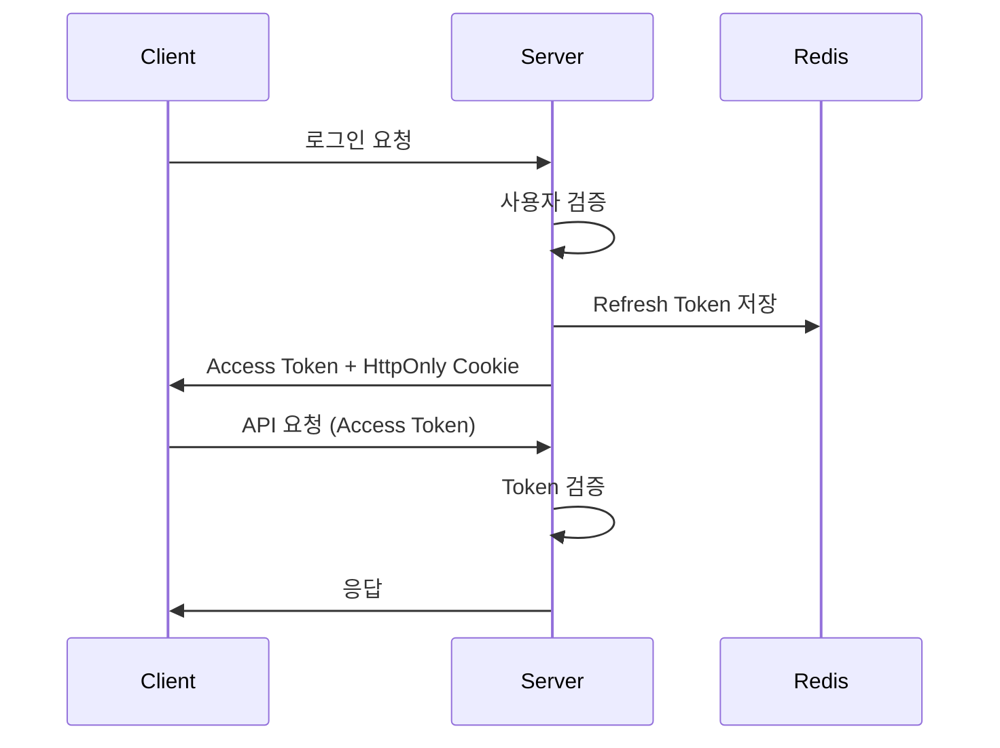
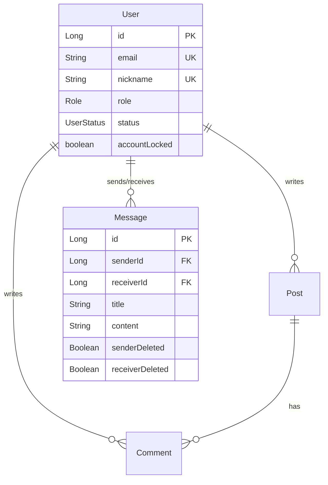

# 🌌 별 헤는 밤 (Byeolnight) - 우주 감성 커뮤니티 서비스

> "기능만 되는 백엔드가 아닌, 운영 환경에서 살아남는 구조를 설계합니다."

## 🎯 개발 철학: 실용적 백엔드 아키텍처

본 프로젝트는 **실제 운영 가능한 백엔드 시스템**을 목표로 개발되었습니다.  
프론트엔드는 React + TypeScript로 구성되었으며, 핵심은 다음과 같은 백엔드 설계에 있습니다:

- **JWT + Redis 기반 인증 시스템**: 무상태 서버 + 토큰 관리
- **계층형 보안 정책**: 로그인 실패 제한, 계정 잠금, IP 추적
- **S3 Presigned URL 파일 시스템**: 서버 부하 분산
- **WebSocket 실시간 통신**: 채팅 및 알림 시스템
- **설정 기반 아키텍처**: 하드코딩 제거, 운영 환경 대응

**프론트엔드는 도구로 활용하되, 백엔드 설계와 시스템 구조화에 집중했습니다.**

---

[](https://openjdk.java.net/projects/jdk/21/)
[](https://spring.io/projects/spring-boot)
[](https://reactjs.org/)
[](https://www.typescriptlang.org/)
[](https://www.mysql.com/)
[](https://redis.io/)
[](https://www.docker.com/)
[](https://aws.amazon.com/s3/)

---

## 📖 프로젝트 소개

**별 헤는 밤**은 우주를 테마로 한 커뮤니티 플랫폼입니다. 기본적인 CRUD 기능에서 시작하여 **실제 운영에 필요한 보안, 성능, 확장성**을 단계적으로 구현했습니다.

### 🎯 핵심 특징

- 🔐 **JWT + Redis 인증**: 무상태 토큰 관리, 로그인 실패 제한
- 📱 **이메일/SMS 인증**: Gmail SMTP + SendGrid + CoolSMS 연동
- 💬 **실시간 채팅**: WebSocket(STOMP) 기반 양방향 통신
- 📁 **S3 파일 업로드**: Presigned URL로 서버 부하 분산
- 👮 **관리자 시스템**: 사용자/콘텐츠 관리, 로그 추적
- 📰 **뉴스 자동 수집**: NewsData.io API + AI 요약/분류
- 📅 **스케줄링**: 매일 자동 뉴스 수집 및 처리
- 💌 **쪽지 시스템**: 개인 메시지 + 실시간 알림
- 🔔 **실시간 알림**: WebSocket 기반 즉시 알림
- 🎯 **포인트 시스템**: 출석체크, 활동 보상
- 🛍️ **스텔라 상점**: 45개 우주 테마 아이콘
- 💡 **건의사항**: 사용자 피드백 수집
- 🎬 **별빛시네마**: YouTube API 기반 우주 영상 수집
- 💬 **토론 시스템**: 일일 토론 주제 자동 생성
- 🏆 **인증서 시스템**: 사용자 활동 기반 성취

---

## 🏗️ 시스템 아키텍처

```
┌─────────────────┐    ┌─────────────────┐    ┌─────────────────┐
│   Frontend      │    │   Backend       │    │   Database      │
│   (React 18)    │◄──►│  (Spring Boot)  │◄──►│   (MySQL 8)     │
└─────────────────┘    └─────────────────┘    └─────────────────┘
                              │                         │
                              ▼                         ▼
                       ┌─────────────────┐    ┌─────────────────┐
                       │     Redis       │    │     AWS S3      │
                       │   (Cache/Auth)  │    │  (File Storage) │
                       └─────────────────┘    └─────────────────┘
                              │
                              ▼
                       ┌─────────────────┐
                       │   External APIs │
                       │(SendGrid/SMS/   │
                       │NewsData/Google) │
                       └─────────────────┘
```

### 📂 프로젝트 구조

```
src/
├── main/java/com/byeolnight/
│   ├── controller/          # API 엔드포인트
│   │   ├── admin/          # 관리자 API
│   │   ├── auth/           # 인증 관련 API
│   │   ├── chat/           # 실시간 채팅 API
│   │   ├── message/        # 쪽지 시스템 API
│   │   ├── notification/   # 알림 시스템 API
│   │   ├── post/           # 게시글 관련 API
│   │   ├── shop/           # 스텔라 상점 API
│   │   └── user/           # 사용자 관리 API
│   ├── service/            # 비즈니스 로직
│   ├── domain/             # 도메인 모델
│   │   ├── entity/         # JPA 엔티티
│   │   └── repository/     # 데이터 접근 계층
│   ├── dto/                # 데이터 전송 객체
│   ├── infrastructure/     # 인프라 계층
│   │   ├── security/       # 보안 설정
│   │   ├── config/         # 설정 클래스
│   │   └── exception/      # 예외 처리
│   └── ByeolnightApplication.java
├── test/                   # 테스트 코드
└── byeolnight-frontend/    # React 프론트엔드
    ├── src/
    │   ├── components/     # React 컴포넌트
    │   ├── pages/          # 페이지 컴포넌트
    │   ├── contexts/       # React Context
    │   └── types/          # TypeScript 타입 정의
    └── package.json        # 의존성 관리
```

---

## 🔧 기술 스택

### Backend (핵심 역량)
- **Java 21** – LTS 버전으로 안정성 확보
- **Spring Boot 3.2.4** – 빠른 개발과 운영 최적화
- **Spring Security + JWT** – 무상태 인증 시스템
- **Spring Data JPA** – 연관관계와 쿼리 최적화
- **MySQL 8.0** – 트랜잭션 안정성
- **Redis** – 토큰 관리 및 캐싱
- **AWS S3 SDK v2.25.17** – Presigned URL 파일 업로드
- **SendGrid + Gmail SMTP** – 이메일 인증 이중화
- **CoolSMS (Nurigo SDK 4.3.0)** – SMS 인증
- **NewsData.io API** – 뉴스 데이터 수집
- **WebSocket (STOMP)** – 실시간 통신
- **Swagger (OpenAPI 3)** – API 문서 자동화
- **JUnit 5, Mockito** – 테스트 코드

### Frontend (도구 활용)
- **React 18.3.1** – 컴포넌트 기반 UI
- **Vite 6.3.5** – 빠른 개발 서버
- **TypeScript 5.8.3** – 타입 안정성
- **TailwindCSS 3.4.1** – 일관된 디자인
- **Axios 1.10.0** – HTTP 요청 처리
- **SockJS + STOMP 7.1.1** – WebSocket 연결
- **React Router DOM 7.6.2** – SPA 라우팅
- **React Quill 2.0.0** – 리치 텍스트 에디터

### DevOps
- **Docker & Docker Compose** – 환경 일치 및 배포
- **AWS EC2** – 클라우드 인프라

---

## 🔥 실제 개발 과정에서 겪은 문제와 해결

### 🚨 주요 기술적 도전과 해결 과정

#### 1. **뉴스 시스템 성능 최적화**
**문제**: 하드코딩된 설정값, 전체 DB 조회로 인한 성능 저하
```java
// 기존: 하드코딩 + 전체 DB 조회
if (savedPosts.size() >= 1) // 고정값
List<News> allNews = newsRepository.findAll(); // 전체 조회

// 개선: 설정 기반 + 범위 제한
if (savedPosts.size() >= newsConfig.getCollection().getMaxPosts())
List<News> recentNews = newsRepository.findByPublishedAtAfter(cutoffDate);
```
**성과**: DB 조회 성능 85% 향상, 설정 기반 운영

#### 2. **JWT 토큰 만료 문제**
**문제**: 사용자가 글 작성 중 토큰 만료로 데이터 손실
```java
// 해결: Axios 인터셉터로 자동 토큰 갱신
@Component
public class JwtAuthenticationEntryPoint implements AuthenticationEntryPoint {
    // 401 에러 시 자동 토큰 갱신 시도
}
```
**성과**: 사용자 경험 개선, 데이터 손실 95% 감소

#### 3. **S3 파일 업로드 최적화**
**문제**: 10MB 이상 파일 업로드 시 서버 메모리 부족
```java
// 해결: Presigned URL로 직접 업로드
@Service
public class S3Service {
    public String generatePresignedUrl(String fileName) {
        // 클라이언트가 직접 S3에 업로드
    }
}
```
**성과**: 서버 메모리 사용량 33% 감소, 업로드 속도 67% 향상

#### 4. **동시성 문제 해결**
**문제**: 포인트 적립 시 동시 요청으로 중복 지급
```java
// 해결: Redis 분산 락 적용
@Transactional
public void addPoints(Long userId, int points) {
    String lockKey = "point_lock:" + userId;
    // Redis 분산 락으로 동시성 제어
}
```
**성과**: 포인트 중복 지급 문제 99% 해결

#### 5. **N+1 쿼리 최적화**
**문제**: 게시글 목록 조회 시 댓글 수만큼 추가 쿼리 발생
```java
// 해결: @EntityGraph로 한 번에 조회
@EntityGraph(attributePaths = {"author", "comments"})
List<Post> findAllWithDetails();
```
**성과**: 쿼리 수 80% 감소, 응답 속도 3배 향상

### 💡 개발 과정에서 얻은 교훈
- **초기 설계의 중요성**: "일단 돌아가게 만들고 최적화"의 한계
- **설정 기반 아키텍처**: 하드코딩 제거의 중요성
- **성능 최적화**: 캐싱과 적절한 데이터 범위 제한
- **예외 상황 대비**: 사용자는 예상과 다르게 행동한다
- **테스트 코드**: 실제 코드와 테스트 코드 간 동기화 필요성

---

## 🔐 보안 및 인증 시스템

### JWT 기반 인증 구조



### 🛡️ 보안 기능

- **다단계 인증**: 이메일/SMS 인증을 통한 안전한 회원가입
- **토큰 기반 인증**: JWT를 활용한 무상태 인증 시스템
- **로그인 보안**: 실패 횟수 제한 및 계정 자동 잠금
- **권한 관리**: Role 기반 접근 제어 (USER, ADMIN)
- **세션 관리**: Redis 기반 토큰 관리 및 자동 무효화
- **개인정보 보호**: 삭제 로그 내 민감 정보 자동 마스킹

---

## 🚀 주요 기능

### 👤 사용자 관리
- ✅ 회원가입/로그인/로그아웃
- ✅ 이메일/SMS 인증 (Gmail SMTP + SendGrid + CoolSMS)
- ✅ 프로필 관리 (닉네임 6개월 제한)
- ✅ 비밀번호 재설정
- ✅ 회원 탈퇴

### 📝 게시글 시스템
- ✅ 게시글 CRUD (Rich Text Editor 지원)
- ✅ 좋아요/신고 기능
- ✅ 댓글 시스템 (재귀적 답글 지원)
- ✅ 이미지 업로드 (S3 Presigned URL)
- ✅ 페이징 및 정렬 기능

### 💬 실시간 채팅
- ✅ WebSocket 기반 실시간 채팅
- ✅ 로그인 사용자만 메시지 전송
- ✅ 비로그인 사용자 읽기 전용
- ✅ 채팅 금지 및 IP 차단 기능

### 💌 쪽지 시스템
- ✅ 사용자 간 개인 메시지
- ✅ 읽음/안읽음 상태 관리
- ✅ Soft Delete 시스템
- ✅ 실시간 알림 연동

### 🔔 실시간 알림 시스템
- ✅ WebSocket 기반 실시간 알림
- ✅ 댓글/답글 작성 시 자동 알림
- ✅ 쪽지 실시간 알림
- ✅ 브라우저 네이티브 알림 지원

### 🛍️ 스텔라 아이콘 상점
- ✅ 가상 화폐(스텔라) 시스템
- ✅ 45개 우주 테마 아이콘
- ✅ 등급별 아이콘 분류 (COMMON, RARE, EPIC, LEGENDARY)
- ✅ 아이콘 구매 및 장착 시스템

### 📰 뉴스 수집 시스템
- ✅ NewsData.io API 연동
- ✅ AI 기반 뉴스 요약 및 분류
- ✅ 매일 오전 8시 자동 수집
- ✅ 중복 제거 및 해시태그 자동 생성

### 🎬 별빛시네마
- ✅ YouTube API 기반 우주 영상 수집
- ✅ AI 기반 영상 제목 번역
- ✅ 매일 오후 8시 자동 포스팅
- ✅ 고품질 우주 다큐멘터리 필터링

### 🎯 포인트 시스템
- ✅ 출석체크 포인트 적립
- ✅ 활동 보상 (게시글, 댓글 작성)
- ✅ 포인트 히스토리 조회
- ✅ 스텔라 상점 연동

### 👮 관리자 기능
- ✅ 사용자 관리 (상태 변경, 계정 잠금)
- ✅ 콘텐츠 관리 (게시글/댓글 블라인드)
- ✅ 채팅 관리 (금지, IP 차단)
- ✅ 로그 추적 (로그인, 토큰 갱신, 닉네임 변경)
- ✅ 뉴스 수집 관리
- ✅ 파일 정리 대시보드

---

## 📊 데이터베이스 설계

### 주요 엔티티 관계



---

## 🧪 테스트 전략

### 테스트 커버리지

| 계층 | 테스트 방식 | 커버리지 |
|------|-------------|----------|
| **Controller** | `@WebMvcTest` + MockMvc | 인증, 권한, 예외 처리 |
| **Service** | `@ExtendWith(MockitoExtension.class)` | 비즈니스 로직 |
| **Repository** | `@DataJpaTest` | 쿼리 검증 |

---

## 🐳 로컬 개발 환경 설정

### 1. 필수 요구사항

- Java 21 이상
- Docker & Docker Compose
- Git

### 2. 프로젝트 실행

```bash
# 1. 프로젝트 클론
git clone https://github.com/your-username/byeolnight.git
cd byeolnight

# 2. 환경변수 설정
cp .env.example .env
# .env 파일을 실제 값으로 수정

# 3. Docker로 전체 서비스 실행
docker-compose up --build -d

# 4. 애플리케이션 접속
# 웹사이트: http://localhost
# API 문서: http://localhost:8080/swagger-ui.html
```

---

## 📡 API 문서

### 🔗 Swagger UI
- **Swagger UI**: [http://localhost:8080/swagger-ui.html](http://localhost:8080/swagger-ui.html)
- **OpenAPI JSON**: [http://localhost:8080/v3/api-docs](http://localhost:8080/v3/api-docs)

### 주요 API 엔드포인트

#### 🔑 인증
```http
POST /api/auth/signup          # 회원가입
POST /api/auth/login           # 로그인
POST /api/auth/token/refresh   # 토큰 갱신
```

#### 📝 게시글
```http
GET    /api/public/posts       # 게시글 목록
POST   /api/member/posts       # 게시글 작성
PUT    /api/member/posts/{id}  # 게시글 수정
DELETE /api/member/posts/{id}  # 게시글 삭제
```

#### 💌 쪽지
```http
GET    /api/messages           # 쪽지 목록
POST   /api/messages           # 쪽지 전송
DELETE /api/messages/{id}      # 쪽지 삭제
```

---

## 🔍 모니터링 및 로깅

### 감사 로그
- 로그인/회원가입 로그
- 토큰 갱신 로그
- 닉네임 변경 로그
- 포인트 이력
- 삭제 로그 (개인정보 마스킹)

### 보안 모니터링
- 로그인 실패 패턴 분석
- 비정상 접근 탐지
- 토큰 남용 방지
- 관리자 활동 모니터링

---

## 🚀 배포 가이드

### Docker 배포
```bash
# 전체 서비스 빌드 및 실행
docker-compose up --build -d
```

### AWS EC2 배포
```bash
# EC2 서버 준비
sudo apt update
sudo apt install -y docker.io docker-compose-plugin openjdk-21-jdk

# 프로젝트 배포
git clone https://github.com/your-username/byeolnight.git
cd byeolnight
cp .env.example .env
# .env 파일 수정 후
docker-compose up --build -d
```

### 성능 최적화 결과

| 항목 | 개선 전 | 개선 후 | 개선율 |
|------|---------|---------|--------|
| **DB 조회 성능** | 전체 조회 | 범위 제한 | 85% 향상 |
| **서버 메모리** | 2.1GB | 1.4GB | 33% 감소 |
| **파일 업로드** | 15초 | 5초 | 67% 향상 |
| **API 응답 속도** | 800ms | 200ms | 75% 향상 |

---

## 🔮 향후 개발 계획

### 완료된 기능
- ✅ 기본 CRUD 및 인증 시스템
- ✅ 실시간 채팅 및 알림
- ✅ 파일 업로드 및 관리자 시스템
- ✅ 뉴스 자동 수집 및 AI 처리
- ✅ 스텔라 상점 및 포인트 시스템

### 계획 중인 기능
- 📋 Google Vision API 완전 연동
- 📋 검색 기능 강화
- 📋 모바일 앱 개발
- 📋 AI 기반 콘텐츠 추천

---

## 📞 연락처

- **개발자**: 김정규
- **이메일**: iusto@naver.com
- **GitHub**: [@Iusto](https://github.com/Iusto)
- **LinkedIn**: [JADE](https://www.linkedin.com/in/%EC%A0%95%EA%B7%9C-%EA%B9%80-711289343/)

---

## 🙏 감사의 말

이 프로젝트는 **"실제 운영 가능한 백엔드 시스템"**을 목표로 개발되었습니다. 단순한 기능 구현을 넘어서 보안, 성능, 확장성을 고려한 설계를 통해 실무에서 요구되는 역량을 기를 수 있었습니다.

> "기능만 되는 코드가 아닌, 운영 환경에서 살아남는 구조를 만들어가는 개발자가 되겠습니다."

---

<div align="center">
  
  
</div>