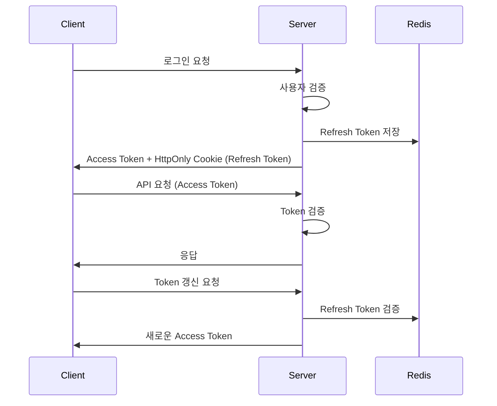
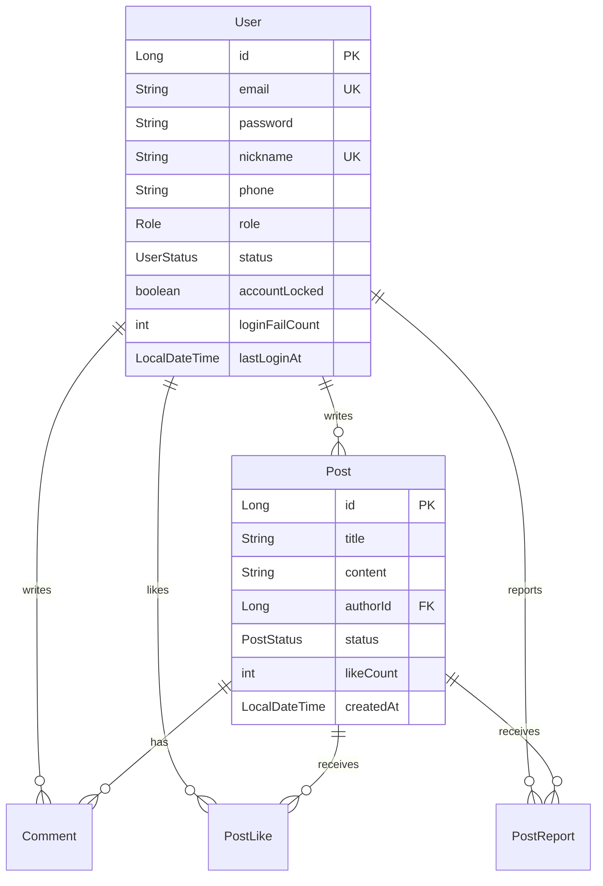

# 🌌 별 헤는 밤 (Byeolnight) - 우주 감성 커뮤니티 서비스

> "기능만 되는 백엔드가 아닌, 운영 환경에서 살아남는 구조를 설계합니다."

[](https://openjdk.java.net/projects/jdk/21/)
[](https://spring.io/projects/spring-boot)
[](https://reactjs.org/)
[](https://www.typescriptlang.org/)
[](https://www.mysql.com/)
[](https://redis.io/)
[](https://www.docker.com/)
[](https://vitejs.dev/)
[](https://tailwindcss.com/)

---

## 📖 프로젝트 소개

**별 헤는 밤**은 우주를 테마로 한 커뮤니티 플랫폼으로, 사용자들이 자유롭게 소통하고 콘텐츠를 공유할 수 있는 공간입니다. 단순한 CRUD 기능을 넘어서 **실제 운영 환경에서 필요한 보안, 성능, 확장성**을 고려하여 설계되었습니다.

### 🎯 핵심 특징

- 🔐 **강화된 보안 시스템**: JWT + Redis 기반 토큰 관리, 단계별 로그인 실패 대응
- 📱 **다중 인증 지원**: 이메일/SMS 인증을 통한 안전한 회원가입 (Gmail SMTP + CoolSMS)
- 💬 **실시간 채팅**: WebSocket(STOMP) 기반 실시간 커뮤니케이션
- 📁 **효율적 파일 관리**: AWS S3 Presigned URL을 활용한 직접 업로드
- 👮 **관리자 시스템**: 사용자 관리, 콘텐츠 모더레이션, 로그 추적
- 📰 **뉴스 크롤링 시스템**: AI 기반 자동 뉴스 수집
- 💌 **쪽지 시스템**: 사용자 간 개인 메시지 기능
- 🔔 **실시간 알림**: WebSocket 기반 즉시 알림 전달 (브라우저 네이티브 알림 지원)
- 🏆 **인증서 시스템**: 사용자 활동 기반 성취 인증
- 🛍️ **스텔라 아이콘 상점**: 가상 화폐 기반 아이콘 구매 시스템 (48개 우주 테마 아이콘)
- 💡 **건의사항 시스템**: 사용자 피드백 수집 및 관리
- 🎯 **포인트 시스템**: 출석체크, 활동 기반 포인트 적립
- 🎬 **영화 추천 시스템**: AI 기반 개인화된 영화 추천
- 💬 **토론 시스템**: 일일 토론 주제 자동 생성 및 참여
- 🚀 **확장 가능한 아키텍처**: 클린 아키텍처 기반 도메인 중심 설계

---

## 🏗️ 시스템 아키텍처

```
┌─────────────────┐    ┌─────────────────┐    ┌─────────────────┐
│   Frontend      │    │   Backend       │    │   Database      │
│   (React 19)    │◄──►│  (Spring Boot)  │◄──►│   (MySQL 8)     │
└─────────────────┘    └─────────────────┘    └─────────────────┘
                              │                         │
                              ▼                         ▼
                       ┌─────────────────┐    ┌─────────────────┐
                       │     Redis       │    │     AWS S3      │
                       │   (Cache/Auth)  │    │  (File Storage) │
                       └─────────────────┘    └─────────────────┘
                              │
                              ▼
                       ┌─────────────────┐
                       │   External APIs │
                       │ (SendGrid/SMS)  │
                       └─────────────────┘
```

### 📂 프로젝트 구조

```
src/
├── main/java/com/byeolnight/
│   ├── controller/          # API 엔드포인트
│   │   ├── admin/          # 관리자 API (사용자, 채팅, 크롤러, 영화, 토론)
│   │   ├── ai/             # AI 뉴스 수신 API
│   │   ├── auth/           # 인증 관련 API
│   │   ├── certificate/    # 인증서 시스템 API
│   │   ├── chat/           # 실시간 채팅 API
│   │   ├── comment/        # 댓글 관리 API
│   │   ├── discussion/     # 토론 시스템 API
│   │   ├── file/           # 파일 업로드 API
│   │   ├── message/        # 쪽지 시스템 API
│   │   ├── notification/   # 알림 시스템 API
│   │   ├── post/           # 게시글 관련 API
│   │   ├── shop/           # 스텔라 아이콘 상점 API
│   │   ├── suggestion/     # 건의사항 API
│   │   └── user/           # 사용자 관리 API
│   ├── service/            # 비즈니스 로직
│   │   ├── admin/          # 관리자 서비스
│   │   ├── ai/             # AI 서비스 (Claude, OpenAI)
│   │   ├── auth/           # 인증 서비스 (이메일, SMS, JWT)
│   │   ├── certificate/    # 인증서 서비스
│   │   ├── chat/           # 채팅 서비스
│   │   ├── cinema/         # 영화 추천 서비스
│   │   ├── comment/        # 댓글 서비스
│   │   ├── crawler/        # 뉴스 크롤링 서비스
│   │   ├── discussion/     # 토론 서비스
│   │   ├── file/           # S3 파일 서비스
│   │   ├── message/        # 쪽지 서비스
│   │   ├── notification/   # 알림 서비스
│   │   ├── post/           # 게시글 서비스
│   │   ├── shop/           # 스텔라 상점 서비스
│   │   ├── suggestion/     # 건의사항 서비스
│   │   └── user/           # 사용자 서비스
│   ├── domain/             # 도메인 모델
│   │   ├── entity/         # JPA 엔티티
│   │   │   ├── certificate/ # 인증서 엔티티
│   │   │   ├── chat/       # 채팅 엔티티
│   │   │   ├── comment/    # 댓글 엔티티
│   │   │   ├── common/     # 공통 엔티티
│   │   │   ├── file/       # 파일 엔티티
│   │   │   ├── log/        # 로그 엔티티
│   │   │   ├── post/       # 게시글 엔티티
│   │   │   ├── shop/       # 상점 엔티티
│   │   │   ├── token/      # 토큰 엔티티
│   │   │   ├── user/       # 사용자 엔티티
│   │   │   ├── Message.java     # 쪽지 엔티티
│   │   │   ├── Notification.java # 알림 엔티티
│   │   │   └── Suggestion.java   # 건의사항 엔티티
│   │   └── repository/     # 데이터 접근 계층
│   ├── dto/                # 데이터 전송 객체
│   ├── infrastructure/     # 인프라 계층
│   │   ├── security/       # 보안 설정
│   │   ├── config/         # 설정 클래스
│   │   └── exception/      # 예외 처리
│   └── ByeolnightApplication.java
├── test/                   # 테스트 코드
└── byeolnight-frontend/    # React 프론트엔드
    ├── src/
    │   ├── components/     # React 컴포넌트
    │   ├── pages/          # 페이지 컴포넌트
    │   ├── contexts/       # React Context
    │   ├── hooks/          # 커스텀 훅
    │   ├── lib/            # 유틸리티 라이브러리
    │   └── types/          # TypeScript 타입 정의
    ├── public/             # 정적 파일
    └── package.json        # 의존성 관리
```

---

## 🔧 기술 스택

### Backend
- **Language**: Java 21 (LTS)
- **Framework**: Spring Boot 3.2.4
- **Security**: Spring Security + JWT
- **ORM**: Spring Data JPA
- **Database**: MySQL 8.0
- **Cache**: Redis 7.0
- **File Storage**: AWS S3 (SDK v2.25.17)
- **Email Service**: SendGrid 4.9.3 + Gmail SMTP
- **SMS Service**: CoolSMS (Nurigo SDK 4.3.0)
- **Real-time**: WebSocket (STOMP)
- **API Documentation**: Swagger (OpenAPI 3)
- **Test**: JUnit 5, Mockito

### Frontend
- **Framework**: React 18.3.1
- **Build Tool**: Vite 6.3.5
- **Language**: TypeScript 5.8.3
- **Styling**: TailwindCSS 3.4.1
- **HTTP Client**: Axios 1.10.0
- **Real-time**: SockJS + STOMP 7.1.1
- **Routing**: React Router DOM 7.6.2
- **Date Handling**: Day.js 1.11.13
- **Rich Text Editor**: React Quill 2.0.0
- **JWT Handling**: jwt-decode 4.0.0

### DevOps
- **Containerization**: Docker & Docker Compose
- **CI/CD**: GitHub Actions
- **Deployment**: AWS EC2

---

## 🔐 보안 및 인증 시스템

### JWT 기반 인증 구조



### 🛡️ 보안 기능

- **다단계 인증**: 이메일/SMS 인증을 통한 안전한 회원가입
- **토큰 기반 인증**: JWT를 활용한 무상태 인증 시스템
- **로그인 보안**: 실패 횟수 제한 및 계정 보호
- **비밀번호 정책**: 강력한 비밀번호 요구사항
- **권한 관리**: Role 기반 접근 제어
- **세션 관리**: 안전한 토큰 관리 및 무효화

---

## 🚀 주요 기능

### 👤 사용자 관리
- ✅ 회원가입/로그인/로그아웃
- ✅ 이메일/SMS 인증 (Gmail SMTP + SendGrid + CoolSMS)
- ✅ 프로필 관리 (닉네임 6개월 제한)
- ✅ 비밀번호 재설정 (이메일 링크)
- ✅ 회원 탈퇴
- ✅ 사용자 인증서 시스템

### 📝 게시글 시스템
- ✅ 게시글 CRUD (Rich Text Editor 지원)
- ✅ 좋아요/신고 기능
- ✅ 댓글 시스템 (재귀적 답글 지원, 블라인드 처리)
- ✅ 이미지 업로드 (S3 Presigned URL)
- ✅ 인기글 자동 선정 및 관리
- ✅ 게시글 신고 및 관리자 처리
- ✅ 게시글 미리보기 기능
- ✅ 페이징 및 정렬 기능

### 💬 실시간 채팅
- ✅ WebSocket 기반 실시간 채팅
- ✅ 로그인 사용자만 메시지 전송
- ✅ 비로그인 사용자 읽기 전용
- ✅ 채팅 금지 및 IP 차단 기능

### 💌 쪽지 시스템
- ✅ 사용자 간 개인 메시지 전송
- ✅ 쪽지 읽음/안읽음 상태 관리
- ✅ 쪽지 목록 조회 및 관리 (페이징 지원)
- ✅ 실시간 쪽지 알림 연동
- ✅ 쪽지 상세 조회 및 답장 기능

### 🔔 실시간 알림 시스템 (완전 구현)
- ✅ **WebSocket 기반 실시간 알림**: STOMP 프로토콜 사용
- ✅ **자동 알림 생성**: 댓글/답글 작성 시 자동 알림
- ✅ **공지사항 전체 알림**: 새 공지사항 등록 시 모든 사용자 알림
- ✅ **쪽지 실시간 알림**: 새 쪽지 수신 시 즉시 알림
- ✅ **읽음/안읽음 상태 관리**: 시각적 구분 및 개수 표시
- ✅ **개별 알림 삭제**: X 버튼으로 개별 삭제 가능
- ✅ **일괄 읽음 처리**: 모든 알림 읽음 처리
- ✅ **브라우저 네이티브 알림**: 권한 허용 시 브라우저 알림
- ✅ **페이징 지원**: 대용량 알림 데이터 효율적 처리

### 🛍️ 스텔라 아이콘 상점
- ✅ 가상 화폐(스텔라) 시스템
- ✅ 45개 우주 테마 아이콘 (행성, 별, 은하, 블랙홀 등)
- ✅ 아이콘 구매 및 장착 시스템
- ✅ 등급별 아이콘 분류 (COMMON, RARE, EPIC, LEGENDARY)
- ✅ 사용자별 보유 아이콘 관리
- ✅ 실시간 아이콘 미리보기

### 📰 뉴스 크롤링 시스템
- ✅ AI 기반 자동 뉴스 수집
- ✅ 뉴스 저장 및 게시
- ✅ 관리자 크롤링 제어

### 🏆 인증서 시스템
- ✅ 사용자 활동 기반 인증서 발급
- ✅ 인증서 조회 및 관리
- ✅ 공개/비공개 인증서 설정

### 💡 건의사항 시스템
- ✅ 사용자 피드백 수집 및 관리
- ✅ 건의사항 CRUD (작성자만 수정/삭제 가능)
- ✅ 공개/비공개 건의사항 설정
- ✅ 건의사항 목록 조회 (페이징 지원)
- ✅ 관리자 건의사항 모니터링

### 🎬 영화 추천 시스템
- ✅ AI 기반 개인화된 영화 추천
- ✅ 사용자 선호도 분석
- ✅ 영화 정보 및 평점 제공
- ✅ 관리자 영화 데이터 관리

### 💬 토론 시스템
- ✅ 일일 토론 주제 자동 생성
- ✅ 사용자 토론 참여 및 의견 공유
- ✅ 토론 주제 스케줄링
- ✅ 관리자 토론 주제 관리

### 🎯 포인트 시스템
- ✅ **출석체크**: 일일 출석 시 포인트 적립
- ✅ **활동 보상**: 게시글 작성, 댓글 작성 시 포인트 지급
- ✅ **포인트 히스토리**: 적립/사용 내역 상세 조회
- ✅ **관리자 포인트 관리**: 포인트 지급/차감 기능
- ✅ **스텔라 상점 연동**: 포인트로 아이콘 구매

### 👮 관리자 기능
- ✅ **사용자 관리**: 목록 조회, 계정 상태 변경 (활성/정지/밴), 계정 잠금/해제
- ✅ **강제 탈퇴 처리**: 사용자 계정 완전 삭제
- ✅ **콘텐츠 관리**: 게시글/댓글 블라인드 처리, 신고 게시글 관리
- ✅ **채팅 관리**: 채팅 금지, IP 차단, 채팅 통계 조회
- ✅ **포인트 관리**: 사용자 포인트 지급/차감
- ✅ **로그 추적**: 로그인/가입 로그, 토큰 갱신 로그, 닉네임 변경 이력
- ✅ **뉴스 크롤링 관리**: 크롤링 상태 조회
- ✅ **영화 관리**: 영화 데이터 및 추천 시스템 관리
- ✅ **토론 관리**: 토론 주제 생성 및 관리
- ✅ **데이터 마이그레이션**: 시스템 데이터 관리 도구

---

## 📊 데이터베이스 설계

### 주요 엔티티 관계



---

## 🧪 테스트 전략

### 테스트 커버리지

| 계층 | 테스트 방식 | 커버리지 |
|------|-------------|----------|
| **Controller** | `@WebMvcTest` + MockMvc | 인증, 권한, 예외 처리 |
| **Service** | `@ExtendWith(MockitoExtension.class)` | 비즈니스 로직, 예외 상황 |
| **Repository** | `@DataJpaTest` | 쿼리 검증, 연관관계 |
| **Integration** | `@SpringBootTest` | 전체 플로우 검증 |

### 주요 테스트 시나리오

```java
// 예시: 로그인 실패 테스트
@Test
void 로그인_실패_횟수_증가_테스트() {
    // Given: 사용자와 잘못된 비밀번호
    User user = createTestUser();
    String wrongPassword = "wrongPassword";
    
    // When: 5번 연속 로그인 실패
    for (int i = 0; i < 5; i++) {
        userService.increaseLoginFailCount(user, "127.0.0.1", "TestAgent");
    }
    
    // Then: 계정이 잠겨야 함
    assertTrue(user.isAccountLocked());
    assertEquals(5, user.getLoginFailCount());
}
```

---

## 🐳 로컬 개발 환경 설정

### 1. 필수 요구사항

- Java 21 이상
- Docker & Docker Compose
- Git

### 2. 프로젝트 클론 및 실행

```bash
# 1. 프로젝트 클론
git clone https://github.com/your-username/byeolnight.git
cd byeolnight

# 2. 환경변수 설정
cp .env.example .env
# .env 파일을 열어서 실제 값들로 수정

# 3. 로컬 개발 환경 (백엔드 + DB만)
./run-local.bat  # Windows
# 또는
docker-compose -f docker-compose.local.yml up -d
gradlew bootRun --args='--spring.profiles.active=local'

# 4. 전체 서비스 Docker 로 실행 (배포용)
docker-compose up --build -d

# 5. 애플리케이션 접속
# 로컬 개발: http://localhost:5173 (프론트), http://localhost:8080 (백엔드)
# Docker 배포: http://localhost (전체 서비스)
# Swagger: http://localhost:8080/swagger-ui.html
```

### 3. 환경변수 설정

```bash
# 1. 환경변수 파일 생성
cp .env.example .env

# 2. .env 파일을 열어서 실제 값으로 수정
# - DB_PASSWORD: 강력한 비밀번호 설정
# - JWT_SECRET: 복잡한 시크릿 키 설정
# - 이메일/SMS/AWS 정보를 실제 값으로 변경
```

**⚠️ 보안 주의사항**
- 환경변수 파일은 보안상 중요하므로 안전하게 관리하세요
- 모든 비밀번호와 API 키는 강력하게 설정하세요

---

## 📡 API 문서

### 🔗 Swagger UI
개발 서버 실행 후 다음 URL에서 API 문서를 확인할 수 있습니다:

- **Swagger UI**: [http://localhost:8080/swagger-ui.html](http://localhost:8080/swagger-ui.html)
- **OpenAPI JSON**: [http://localhost:8080/v3/api-docs](http://localhost:8080/v3/api-docs)

#### 🏷️ API 그룹 분류
- 🌍 **공개 API**: 비회원 접근 가능
- 🔑 **인증 API**: 로그인, 회원가입, 토큰 관리
- 👤 **회원 API**: 사용자 프로필 및 계정 관리
- 📝 **게시글 API**: 게시글 CRUD 및 댓글
- 💬 **채팅 API**: 실시간 채팅 기능
- 💌 **쪽지 API**: 사용자 간 개인 메시지
- 🔔 **알림 API**: 실시간 알림 시스템
- 🛍️ **상점 API**: 스텔라 아이콘 상점
- 🏆 **인증서 API**: 사용자 성취 인증서
- 📁 **파일 API**: S3 파일 업로드
- 💡 **건의사항 API**: 사용자 피드백 시스템
- 🎬 **영화 API**: AI 기반 영화 추천
- 💬 **토론 API**: 일일 토론 시스템
- 👮 **관리자 API**: 사용자 및 컨텐츠 관리

### 주요 API 엔드포인트

#### 🔑 인증 (Authentication)
```http
POST /api/auth/signup          # 회원가입
POST /api/auth/login           # 로그인
POST /api/auth/logout          # 로그아웃
POST /api/auth/token/refresh   # 토큰 갱신
POST /api/auth/email/send      # 이메일 인증코드 발송
POST /api/auth/email/verify    # 이메일 인증코드 검증
POST /api/auth/phone/send      # SMS 인증코드 발송
POST /api/auth/phone/verify    # SMS 인증코드 검증
```

#### 👤 사용자 (User)
```http
GET  /api/users/me             # 내 정보 조회
PUT  /api/users/profile        # 프로필 수정
POST /api/auth/password/reset-request  # 비밀번호 재설정 요청
POST /api/auth/password/reset  # 비밀번호 재설정
```

#### 📝 게시글 (Post)
```http
GET    /api/public/posts       # 게시글 목록 (공개)
POST   /api/member/posts       # 게시글 작성 (로그인 필요)
GET    /api/member/posts/{id}  # 게시글 상세 조회
PUT    /api/member/posts/{id}  # 게시글 수정
DELETE /api/member/posts/{id}  # 게시글 삭제
POST   /api/posts/{id}/like    # 게시글 좋아요
POST   /api/posts/{id}/report  # 게시글 신고
```

#### 💬 댓글 (Comment)
```http
GET    /api/posts/{postId}/comments     # 댓글 목록 조회
POST   /api/posts/{postId}/comments     # 댓글 작성
PUT    /api/comments/{id}               # 댓글 수정
DELETE /api/comments/{id}               # 댓글 삭제
```

#### 💌 쪽지 (Message)
```http
GET    /api/messages           # 쪽지 목록 조회
POST   /api/messages           # 쪽지 전송
GET    /api/messages/{id}      # 쪽지 상세 조회
PATCH  /api/messages/{id}/read # 쪽지 읽음 처리
```

#### 🔔 알림 (Notification)
```http
GET    /api/member/notifications           # 알림 목록 조회 (페이징)
GET    /api/member/notifications/unread    # 읽지 않은 알림 조회
GET    /api/member/notifications/unread/count # 읽지 않은 알림 개수
PUT    /api/member/notifications/{id}/read # 알림 읽음 처리
PUT    /api/member/notifications/read-all  # 모든 알림 읽음 처리
DELETE /api/member/notifications/{id}     # 알림 삭제
```

#### 🛍️ 스텔라 상점 (Stella Shop)
```http
GET    /api/shop/icons         # 아이콘 목록 조회
POST   /api/shop/icons/{id}/purchase  # 아이콘 구매
GET    /api/shop/my-icons      # 보유 아이콘 조회
POST   /api/shop/icons/{id}/equip     # 아이콘 장착
```

#### 🏆 인증서 (Certificate)
```http
GET    /api/certificates       # 인증서 목록 조회 (공개)
GET    /api/certificates/my    # 내 인증서 조회
PATCH  /api/certificates/{id}/visibility  # 인증서 공개/비공개 설정
```

#### 📁 파일 (File)
```http
POST   /api/files/presigned-url  # S3 Presigned URL 생성
```

#### 👮 관리자 (Admin)
```http
# 사용자 관리
GET    /api/admin/users        # 사용자 목록 조회
PATCH  /api/admin/users/{id}/status  # 사용자 상태 변경
PATCH  /api/admin/users/{id}/lock    # 계정 잠금/해제
DELETE /api/admin/users/{id}   # 강제 탈퇴

# 게시글 관리
GET    /api/admin/posts/reported     # 신고된 게시글 조회
GET    /api/admin/posts/blinded      # 블라인드된 게시글 조회
PATCH  /api/admin/posts/{id}/blind   # 게시글 블라인드 처리

# 댓글 관리
PATCH  /api/admin/comments/{id}/blind  # 댓글 블라인드 처리

# 채팅 관리
POST   /api/admin/chat/ban       # 채팅 금지 처리
POST   /api/admin/chat/ip-block  # IP 차단 처리
GET    /api/admin/chat/stats     # 채팅 통계 조회

# 크롤링 관리
POST   /api/admin/crawler/start  # 크롤링 시작
POST   /api/admin/crawler/stop   # 크롤링 중지
GET    /api/admin/crawler/status # 크롤링 상태 조회

# 영화 관리
GET    /api/admin/cinema/movies     # 영화 목록 관리
POST   /api/admin/cinema/movies     # 영화 추가
PUT    /api/admin/cinema/movies/{id} # 영화 정보 수정
DELETE /api/admin/cinema/movies/{id} # 영화 삭제

# 토론 관리
GET    /api/admin/discussions       # 토론 주제 목록
POST   /api/admin/discussions       # 토론 주제 생성
PUT    /api/admin/discussions/{id}  # 토론 주제 수정
DELETE /api/admin/discussions/{id}  # 토론 주제 삭제
```

#### 💡 건의사항 (Suggestion)
```http
GET    /api/suggestions       # 건의사항 목록 조회 (페이징)
POST   /api/suggestions       # 건의사항 작성
GET    /api/suggestions/{id}  # 건의사항 상세 조회
PUT    /api/suggestions/{id}  # 건의사항 수정 (작성자만)
DELETE /api/suggestions/{id}  # 건의사항 삭제 (작성자만)
```

#### 🎬 영화 추천 (Cinema)
```http
GET    /api/cinema/recommendations  # 개인화된 영화 추천
GET    /api/cinema/movies          # 영화 목록 조회
GET    /api/cinema/movies/{id}     # 영화 상세 정보
```

#### 💬 토론 (Discussion)
```http
GET    /api/discussions            # 토론 목록 조회
GET    /api/discussions/today      # 오늘의 토론 주제
POST   /api/discussions/{id}/participate  # 토론 참여
```

#### 🎯 포인트 (Point)
```http
GET    /api/points/status     # 포인트 현황 조회
GET    /api/points/history    # 포인트 히스토리 조회
POST   /api/points/attendance # 출석체크
```

---

## 🔍 모니터링 및 로깅

### 감사 로그 (Audit Logs)

시스템의 모든 중요한 활동은 데이터베이스에 기록됩니다:

- **로그인 로그**: 성공/실패, IP, User-Agent
- **회원가입 로그**: 성공/실패 사유, IP 추적
- **토큰 갱신 로그**: Refresh Token 사용 이력
- **닉네임 변경 로그**: 변경 전후 값, 변경 시점

### 로그 파일 위치

```
logs/
├── application.log    # 전체 애플리케이션 로그
└── crawler.log        # 크롤러 전용 로그
```

### 보안 모니터링

- 로그인 실패 패턴 분석 및 자동 차단
- 비정상 접근 탐지 및 차단
- 토큰 남용 방지 시스템
- 실시간 보안 이벤트 처리

---

## 🚀 배포 및 운영

### 배포 가이드

**로컬 개발 환경**
```bash
# 데이터베이스만 실행
docker-compose -f docker-compose.local.yml up -d

# Spring Boot 애플리케이션 실행
gradlew bootRun --args='--spring.profiles.active=local'

# 프론트엔드 실행
cd byeolnight-frontend
npm run dev
```

**Docker 배포 환경**
```bash
# 전체 서비스 빌드 및 실행
docker-compose up --build -d

# 또는 배포 스크립트 사용
./deploy/deploy.sh
```

**AWS 배포**
- 상세한 AWS 배포 가이드는 `deploy/aws-setup.md` 참조
- 추천 인스턴스: t3.medium 이상 (4GB RAM)

### 운영 환경 고려사항

- **다운타임 최소화 배포**: Blue-Green 전략 기반의 Docker 컨테이너 전환 구조
- **로드 밸런싱**: AWS ALB 활용
- **데이터베이스**: RDS Multi-AZ 구성
- **캐시**: ElastiCache Redis 클러스터
- **모니터링**: CloudWatch + 커스텀 메트릭

---

## 🔮 향후 개발 계획

### Phase 1 (완료)
- ✅ 기본 CRUD 및 인증 시스템
- ✅ 실시간 채팅
- ✅ 파일 업로드
- ✅ 관리자 시스템

### Phase 2 (완료)
- ✅ **완전한 실시간 알림 시스템** (WebSocket + STOMP)
  - 댓글/답글 알림 자동 생성
  - 공지사항 전체 사용자 알림
  - 쪽지 실시간 알림
  - 읽음/안읽음 상태 관리
  - 개별 알림 삭제 기능
- ✅ **신고 시스템 완성**
  - 실시간 승인/거부 처리
  - 상세 신고 내역 표시
  - 처리 상태 실시간 업데이트
- ✅ 쪽지 시스템
- ✅ 뉴스 자동 수집 및 분류 (AI 크롤링)
- ✅ 스텔라 아이콘 상점 시스템
- ✅ 인증서 시스템
- ✅ 댓글 답글 시스템 (재귀적 답글 지원)

### Phase 3 (완료)
- ✅ **신고 시스템 개선**: 실시간 승인/거부 처리, 상세 내역 표시
- ✅ **관리자 시스템 완성**: 사용자/콘텐츠/채팅 관리 완전 구현
- ✅ **시스템 안정성 강화**: 예외 처리 및 로깅 개선

### Phase 4 (완료)
- ✅ **영화 추천 시스템**: AI 기반 개인화된 영화 추천 서비스
- ✅ **토론 시스템**: 일일 토론 주제 자동 생성 및 참여 기능
- ✅ **시스템 최적화**: 성능 개선 및 안정성 강화

### Phase 5 (계획)
- 📋 검색 기능 강화 (Elasticsearch 연동)
- 📋 캐싱 최적화 (Redis 활용)
- 📋 모바일 앱 (React Native)
- 📋 AI 기반 콘텐츠 추천 고도화

---

## 📝 배포 체크리스트

### 배포 전 확인사항

- [ ] 환경변수 설정 및 보안 정보 업데이트
- [ ] 데이터베이스 연결 정보 확인
- [ ] 외부 API 서비스 연동 설정
- [ ] 도메인 및 URL 설정
- [ ] 서버 네트워크 및 보안 설정
- [ ] SSL/TLS 인증서 설정

### 배포 명령어

```bash
# 1. 프로젝트 준비
git clone https://github.com/your-username/byeolnight.git
cd byeolnight

# 2. 환경 설정
# 환경변수 파일 설정 및 보안 설정

# 3. 배포 실행
# 배포 스크립트 실행
```

## 🤝 기여하기

1. Fork the Project
2. Create your Feature Branch (`git checkout -b feature/AmazingFeature`)
3. Commit your Changes (`git commit -m 'Add some AmazingFeature'`)
4. Push to the Branch (`git push origin feature/AmazingFeature`)
5. Open a Pull Request

---

## 📄 라이선스

이 프로젝트는 MIT 라이선스 하에 배포됩니다. 자세한 내용은 `LICENSE` 파일을 참조하세요.

---

## 📞 연락처

- **개발자**: [김정규]
- **이메일**: iusto@naver.com
- **GitHub**: [@JADE](https://github.com/Iusto)
- **LinkedIn**: [JADE](https://www.linkedin.com/in/%EC%A0%95%EA%B7%9C-%EA%B9%80-711289343/)

---

## 🙏 감사의 말

이 프로젝트는 **"실제 운영 가능한 백엔드 시스템"**을 목표로 개발되었습니다. 단순한 기능 구현을 넘어서 보안, 성능, 확장성을 고려한 설계를 통해 실무에서 요구되는 역량을 기를 수 있었습니다.

> "기능만 되는 코드가 아닌, 운영 환경에서 살아남는 구조를 만들어가는 개발자가 되겠습니다."

---

<div align="center">
  
  
</div>