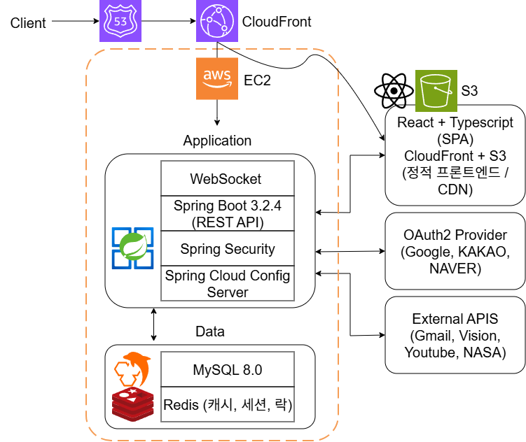

# 🌌 별 헤는 밤 (Byeolnight)

> 실시간 채팅, 게시판, 우주 콘텐츠를 즐기는 커뮤니티 플랫폼

[](https://openjdk.java.net/projects/jdk/21/)
[](https://spring.io/projects/spring-boot)
[](https://spring.io/projects/spring-security)
[](https://spring.io/projects/spring-data-jpa)
[](http://www.querydsl.com/)
[](https://reactjs.org/)
[](https://www.typescriptlang.org/)
[](https://vitejs.dev/)
[](https://www.mysql.com/)
[](https://redis.io/)
[](https://www.docker.com/)
[](https://github.com/Iusto/byeolnight/actions)

---

## 🎯 주요 기능

### 💬 실시간 소통
- **Native WebSocket 채팅**: 경량화된 실시간 대화 (로그인 필수)
- **쪽지 시스템**: 1:1 개인 메시지 전송
- **브라우저 알림**: 새 메시지 도착 시 데스크톱 알림

### 📝 커뮤니티
- **게시글/댓글**: 좋아요, 신고, 계층형 댓글 지원
- **Toast UI 에디터**: 색상, 정렬, 이미지 업로드 (클립보드 붙여넣기 지원)
- **이미지 검열**: Google Vision API로 부적절한 이미지 자동 차단

### 🔐 인증/보안
- **소셜 로그인**: Google, Kakao, Naver OAuth2 연동
- **JWT + Redis**: Access/Refresh Token 자동 갱신 + 블랙리스트
- **이메일 인증**: HTML 템플릿 기반 인증 코드

### 🌌 우주 콘텐츠
- **우주 뉴스**: 자동 수집 및 분류
- **날씨 정보**: 실시간 날씨 + 별 관측 가능 여부
- **ISS 관측 예보**: TLE + SGP4 궤도 계산 기반 실제 관측 시간/방향/고도각 예측
- **우주영상 큐레이터**: NASA, SpaceX 등 우주 관련 영상 큐레이션

### 🎨 사용자 시스템
- **스텔라 아이콘**: 포인트로 구매 가능한 프로필 아이콘 (60종+)
- **인증서 시스템**: 활동 기반 인증서 발급 + 대표 인증서 설정
- **포인트 시스템**: 글 작성, 좋아요 등 활동으로 포인트 획득

---

## 🏗️ 아키텍처



### 계층별 구성

**프론트엔드 (S3 + CloudFront):**
- React 18 + TypeScript (SPA)
- S3 정적 호스팅 + CloudFront CDN
- GitHub Actions 자동 배포

**백엔드 (EC2 + Docker):**
- Spring Boot 3.2.4 (REST API)
- Spring Security 6.2.3 (JWT + OAuth2)
- Spring Cloud Config Server (Private Git 기반 중앙 설정 관리)
- Native WebSocket 실시간 통신

**데이터 계층:**
- MySQL 8.0 (주 데이터베이스)
- Redis 7.0 (캐시 + 세션 + 메시지 큐)

**AWS 인프라:**
- S3: 프론트엔드 빌드 파일 + 사용자 업로드 이미지
- CloudFront: 글로벌 CDN (프론트엔드 + 이미지 + API 프록시)
- Route 53: DNS 관리
- EC2: 백엔드 API 서버

**외부 연동:**
- OAuth2 Provider (Google, Kakao, Naver)
- External APIs (Gmail, Vision, NASA 등)

---

## 🔧 핵심 구현

### ⚡ 성능 최적화
- **프론트엔드 분리**: S3 + CloudFront로 정적 파일 서빙 (백엔드 부하 제로)
- **S3 Presigned URL**: 클라이언트 직접 업로드로 서버 부하 제로
- **CloudFront CDN**: 전 세계 엣지 캐싱 (프론트엔드 + 이미지)
- **Redis 캐싱**: 세션 + 데이터 캐싱
- **QueryDSL**: 동적 쿼리 최적화
- **커넥션 풀 튜닝**: HikariCP, Redis, HTTP 풀 최적화
- **하이브리드 캐싱**: 70개 도시 Proactive + On-Demand 캐싱 (k6 부하테스트 검증)

#### k6 부하테스트 결과 (별도 EC2에서 실행)

| API | 총 요청 | p(95) 응답시간 | 캐시 적중률 | 초당 처리량 |
|-----|---------|---------------|-----------|-----------|
| Weather 캐시 | 316,953건 | 49.29ms | 100% (Actuator 검증) | 2,112 req/s |
| ISS 캐시 | 290,792건 | 51.15ms | 99.995% (Actuator 검증) | 1,938 req/s |

### 🔒 보안
- **JWT + Redis**: Token 자동 갱신 + 블랙리스트
- **OAuth2**: 3사 소셜 로그인 통합
- **S3 + CloudFront OAC**: S3 직접 접근 차단 (CloudFront만 허용)
- **DB 제약조건 기반 동시성 제어**: UNIQUE 제약조건 + @Transactional
- **Google Vision API**: 이미지 자동 검열

### 🔄 실시간 처리
- **Native WebSocket**: 경량화된 실시간 통신
- **브라우저 알림**: Notification API 통합

### 🛠️ 개발 인프라
- **Spring Cloud Config**: Private Git 저장소 기반 중앙 설정 관리 + 암호화
- **GitHub Actions**: 자동 배포 (프론트엔드 → S3, 백엔드 → EC2)
- **Swagger UI**: 자동 API 문서화
- **Docker Compose**: 백엔드 컨테이너 관리

#### Spring Cloud Config Server 구조

민감 정보(DB 비밀번호, JWT Secret, OAuth2 Key 등)는 Public 저장소에 포함되지 않는다.
별도의 Private Git 저장소(`config-repo`)에서 환경별 설정 파일을 관리하며,
Config Server가 기동 시 해당 저장소를 Clone하여 설정을 제공한다.

```
[Private Git Repository]
└── config-repo/
    └── byeolnight-prod.yml   # 운영 환경 설정 (DB, JWT, OAuth2 등)
    
         ↓ (Spring Cloud Config Server가 Pull)

[EC2 Docker]
├── config-server (port 8888)  →  Private Git에서 설정 Pull
└── app (port 8080)            →  Config Server에서 설정 주입
```

배포 시 `deploy.sh`에서 `config-repo`를 최신화(`git pull`)한 뒤 Config Server를 재기동하므로,
설정 변경은 코드 배포 없이 Private Git 저장소 수정만으로 반영된다.

---

## 📚 문서

### 설계 문서
- [📋 설계 철학 및 DDD](./docs/01_design-philosophy.md)
- [🧱 도메인 모델](./docs/02_domain-model.md)
- [🏛️ 애플리케이션 구조](./docs/03_architecture.md)
- [🎯 핵심 도메인별 구조](./docs/04_core-domains.md)

### 기술 상세
- [🔧 기술 스택 상세](./docs/05_tech-stack.md)
- [📊 성능 최적화 전략](./docs/PERFORMANCE.md)
- [🌤️ 날씨 캐싱 시스템 개선 여정](./docs/13_weather-caching-evolution.md)
- [🛰️ ISS 관측 예보 시스템](./docs/15_iss-pass-prediction.md)
- [📁 이미지 업로드 파이프라인](./docs/11_image-upload-pipeline.md)
- [📧 이메일 비동기 처리](./docs/12_email-async-processing.md)
- [🧪 테스트 전략](./docs/06_testing.md)
- [📊 데이터베이스 설계](./docs/08_database-design.md)

### 트러블슈팅
- [🚀 자동배포 트러블슈팅](./docs/troubleshooting/deployment-issues.md)
- [🌙 JWT Config Server 암호화 문제](./docs/troubleshooting/jwt-config-server-issue.md)
- [🔄 소셜 계정 탈퇴 복구](./docs/11_social-account-recovery.md)
- [⏰ 스케줄러 테스트](./docs/10_scheduler-testing.md)


> 📚 **상세 정보**: [기술 스택 상세 문서](./docs/06_tech-stack.md)

---

<div align="center">

**🌟 별 헤는 밤에서 우주의 신비를 함께 탐험해보세요! 🌟**

</div>
