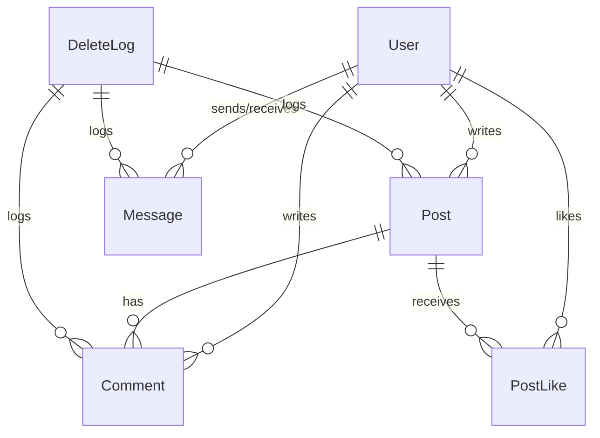

# 02. 도메인 모델 개요

> 핵심 도메인을 중심으로 비즈니스 복잡도를 설계에 녹여낸 구조

## 🧱 주요 도메인 요약

Byeolnight는 다음과 같은 주요 도메인으로 구성됩니다:

| 도메인        | 설명                        | 주요 엔티티 (Aggregate Root 기준)       |
| ---------- | ------------------------- | -------------------------------- |
| **인증**     | 회원가입, 로그인, 토큰 갱신, 잠금 처리 등 | `User`, `PasswordResetToken`     |
| **게시글**    | 게시글 작성, 댓글, 좋아요, 신고 등     | `Post`, `Comment`, `PostReport`  |
| **쪽지**     | 사용자 간 1:1 비공개 메시지         | `Message`                        |
| **알림**     | 댓글/쪽지 등 이벤트 기반 실시간 알림     | `Notification`                   |
| **채팅**     | 공개 채팅방, IP 차단, 금지 기능 등    | `ChatMessage`                    |
| **상점**     | 포인트로 구매 가능한 우주 아이콘        | `StellaIcon`, `UserIcon`         |
| **뉴스/시네마** | 외부 API 기반 콘텐츠 수집, AI 요약   | `News`, `Cinema`                 |
| **인증서**    | 활동 기반 성취 인증               | `Certificate`, `UserCertificate` |
| **건의사항**   | 사용자 피드백 및 운영 개선 건의        | `Suggestion`                     |
| **삭제로그**   | 블라인드/삭제 이력 자동 저장          | `DeleteLog`                      |

## 🔄 관계 다이어그램 (요약)

> 전체 ERD 및 상세 스키마는 [📊 데이터베이스 설계 문서](./11_database-design.md) 참고

---

## 🗂 유비쿼터스 언어 사전 (Ubiquitous Language Glossary)

> 기획자, 개발자, 사용자가 모두 동일하게 이해하는 비즈니스 용어 정의

### 핵심 도메인 용어

| 용어 | 정의 | 비즈니스 규칙 | 속한 도메인 |
|------|------|---------------|-------------|
| **User** | 이메일/SMS 인증을 통해 로그인하며 활동하는 주체 | • 로그인 실패 5회 시 계정 잠금 • 닉네임 변경은 6개월에 1회만 가능 | 인증, 전체 |
| **Post** | 사용자가 작성하는 텍스트 콘텐츠 단위 | • 신고 3회 누적 시 자동 블라인드 • 좋아요 10개 이상 시 인기글 후보 | 게시글 |
| **Token** | JWT 기반 인증 수단, Redis에 저장 | • Access Token: 30분 TTL • Refresh Token: 7일 TTL • 재사용 감지 시 즉시 무효화 | 인증 |
| **Message** | 비공개 1:1 쪽지 대화 단위 | • Soft Delete (양쪽 삭제 시에만 영구 삭제) • 3년 경과 후 자동 정리 | 쪽지 |
| **StellaIcon** | 포인트로 구매 가능한 우주 테마 아이콘 | • 등급별 가격 차등 (COMMON: 100P, LEGENDARY: 1000P) • 구매 후 즉시 장착 가능 | 상점 |

### 도메인별 특수 용어

#### 인증 도메인
- **계정 잠금**: 로그인 실패 5회 시 30분간 로그인 차단
- **토큰 갱신**: Access Token 만료 시 자동으로 새 토큰 발급
- **토큰 탈취 감지**: Refresh Token 재사용 시 보안 위협으로 판단

#### 게시글 도메인
- **블라인드 처리**: 부적절한 콘텐츠를 숨기되 완전 삭제하지 않는 조치
- **인기글**: 좋아요 10개 이상 + 댓글 5개 이상인 게시글
- **신고 누적**: 동일 게시글에 대한 신고가 3회 이상 접수된 상태

#### 포인트 시스템
- **출석 포인트**: 일일 1회 로그인 시 10포인트 지급
- **활동 포인트**: 게시글 작성(20P, 일일 5개 제한), 댓글 작성(5P, 일일 20개 제한), 좋아요 받음(2P), 좋아요 주기(1P, 일일 10개 제한)
- **신고 보상**: 유효한 신고 시 10포인트 지급

> 위 용어들은 코드, 문서, 회의 등 모든 커뮤니케이션에서 동일한 의미로 사용됩니다.

---

👉 다음 문서: [03. 애플리케이션 구조](./03_architecture.md)
