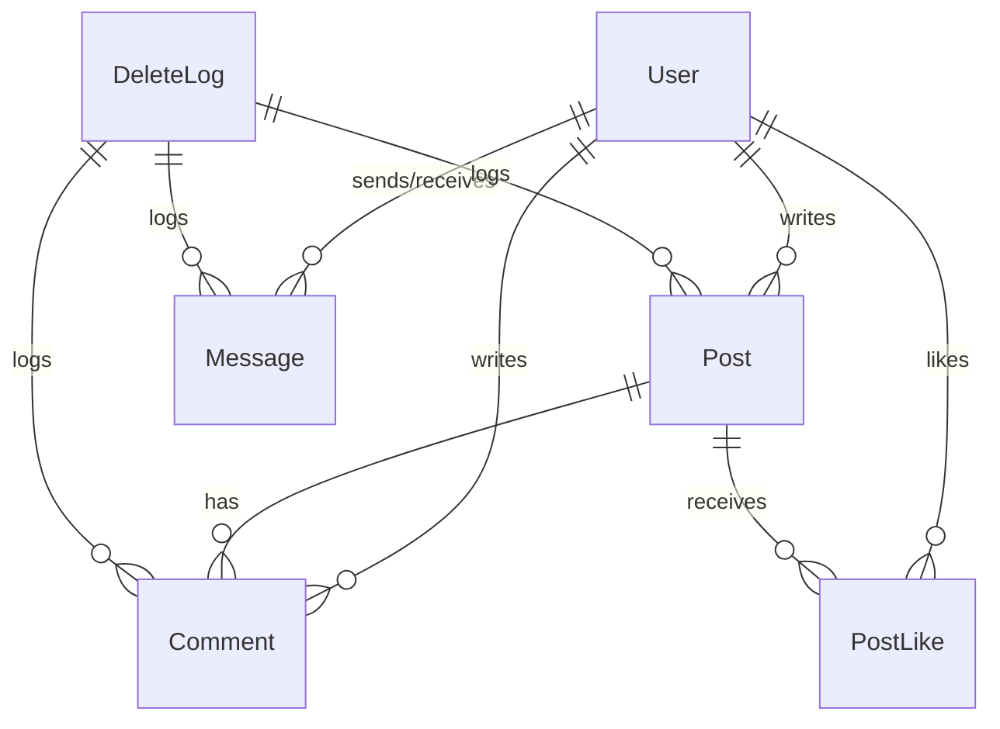

# 02. 도메인 모델 개요

> 핵심 도메인을 중심으로 비즈니스 복잡도를 설계에 녹여낸 구조

## 🧱 주요 도메인 요약

Byeolnight는 다음과 같은 주요 도메인으로 구성됩니다:

| 도메인        | 설명                        | 주요 엔티티 (Aggregate Root 기준)       |
| ---------- | ------------------------- | -------------------------------- |
| **인증**     | 회원가입, 로그인, 토큰 갱신, 잠금 처리 등 | `User`, `Token`                  |
| **게시글**    | 게시글 작성, 댓글, 좋아요, 신고 등     | `Post`, `Comment`, `PostReport`  |
| **쪽지**     | 사용자 간 1:1 비공개 메시지         | `Message`                        |
| **알림**     | 댓글/쪽지 등 이벤트 기반 실시간 알림     | `Notification`                   |
| **채팅**     | 공개 채팅방, IP 차단, 금지 기능 등    | `ChatRoom`, `ChatMessage`        |
| **상점**     | 포인트로 구매 가능한 우주 아이콘        | `StellaIcon`, `UserIcon`         |
| **뉴스/시네마** | 외부 API 기반 콘텐츠 수집, AI 요약   | `News`, `Cinema`                 |
| **인증서**    | 활동 기반 성취 인증               | `Certificate`, `UserCertificate` |
| **건의사항**   | 사용자 피드백 및 운영 개선 건의        | `Suggestion`                     |
| **삭제로그**   | 블라인드/삭제 이력 자동 저장          | `DeleteLog`                      |

## 🔄 관계 다이어그램 (요약)

> 전체 ERD는 DB 설계 문서 또는 schema.sql 참고 예정

---

## 🗂 유비쿼터스 언어 사전 (Ubiquitous Language Glossary)

| 용어               | 정의                                | 속한 도메인           |
| ---------------- | --------------------------------- | ---------------- |
| **User**         | 이메일/SMS 인증을 통해 로그인하며 활동하는 주체      | 인증, 쪽지, 게시글 등 전체 |
| **Post**         | 사용자가 작성하는 텍스트 콘텐츠 단위              | 게시글              |
| **Comment**      | Post에 종속되는 사용자 반응형 텍스트            | 게시글              |
| **Message**      | 비공개 1:1 쪽지 대화 단위                  | 쪽지               |
| **Notification** | 댓글/쪽지 등 이벤트 발생 시 사용자에게 전송되는 알림 객체 | 알림               |
| **StellaIcon**   | 사용자가 상점에서 구매할 수 있는 우주 테마 아이콘      | 상점               |
| **Certificate**  | 활동 기준으로 자동 발급되는 디지털 성취 인증서        | 인증서              |
| **Token**        | JWT 기반으로 생성되며, Redis에 저장되는 인증 수단  | 인증               |
| **DeleteLog**    | 사용자가 삭제한 게시글/댓글/쪽지에 대한 이력 정보      | 삭제 로그            |
| **ChatRoom**     | 실시간 공개 채팅이 이루어지는 공간 단위            | 채팅               |

> 위 용어들은 코드, 문서, 회의 등 모든 커뮤니케이션에서 동일한 의미로 사용됩니다.

---

👉 다음 문서: [03. 애플리케이션 구조](./03_architecture.md)
