# 09. 데이터베이스 설계

> 도메인 모델을 기반으로 한 데이터베이스 스키마 설계와 ERD

## 🗂️ 전체 ERD

```mermaid
erDiagram
    %% 사용자 도메인
    User {
        bigint id PK
        varchar email UK
        varchar password
        varchar nickname UK
        varchar phone
        boolean email_verified
        boolean phone_verified
        int points
        int login_fail_count
        datetime locked_until
        datetime created_at
        datetime updated_at
    }
    
    DailyAttendance {
        bigint id PK
        bigint user_id FK
        date attendance_date UK
        datetime created_at
    }
    
    PointHistory {
        bigint id PK
        bigint user_id FK
        int points
        varchar reason
        datetime created_at
    }
    
    %% 게시글 도메인
    Post {
        bigint id PK
        bigint user_id FK
        varchar title
        text content
        varchar category
        boolean is_blinded
        int like_count
        int comment_count
        datetime created_at
        datetime updated_at
    }
    
    Comment {
        bigint id PK
        bigint post_id FK
        bigint user_id FK
        bigint parent_id FK
        text content
        boolean is_blinded
        int like_count
        datetime created_at
        datetime updated_at
    }
    
    PostLike {
        bigint id PK
        bigint post_id FK
        bigint user_id FK
        datetime created_at
    }
    
    CommentLike {
        bigint id PK
        bigint comment_id FK
        bigint user_id FK
        datetime created_at
    }
    
    PostReport {
        bigint id PK
        bigint post_id FK
        bigint reporter_id FK
        varchar reason
        varchar status
        datetime created_at
    }
    
    CommentReport {
        bigint id PK
        bigint comment_id FK
        bigint reporter_id FK
        varchar reason
        varchar status
        datetime created_at
    }
    
    %% 쪽지 도메인
    Message {
        bigint id PK
        bigint sender_id FK
        bigint receiver_id FK
        varchar title
        text content
        boolean is_read
        boolean sender_deleted
        boolean receiver_deleted
        datetime created_at
    }
    
    %% 알림 도메인
    Notification {
        bigint id PK
        bigint user_id FK
        varchar type
        varchar title
        text content
        boolean is_read
        datetime created_at
    }
    
    %% 채팅 도메인
    ChatRoom {
        bigint id PK
        varchar name
        text description
        boolean is_active
        datetime created_at
    }
    
    ChatMessage {
        bigint id PK
        bigint room_id FK
        bigint user_id FK
        text content
        datetime created_at
    }
    
    ChatBan {
        bigint id PK
        bigint room_id FK
        bigint user_id FK
        varchar reason
        datetime banned_until
        datetime created_at
    }
    
    %% 상점 도메인
    StellaIcon {
        bigint id PK
        varchar name
        varchar image_url
        int price
        varchar grade
        boolean is_active
        datetime created_at
    }
    
    UserIcon {
        bigint id PK
        bigint user_id FK
        bigint icon_id FK
        boolean is_equipped
        datetime purchased_at
    }
    
    %% 인증서 도메인
    Certificate {
        bigint id PK
        varchar name
        text description
        varchar image_url
        varchar condition_type
        int condition_value
        datetime created_at
    }
    
    UserCertificate {
        bigint id PK
        bigint user_id FK
        bigint certificate_id FK
        boolean is_public
        datetime earned_at
    }
    
    %% 콘텐츠 도메인
    News {
        bigint id PK
        varchar title
        text content
        varchar source_url
        varchar image_url
        text ai_summary
        datetime published_at
        datetime created_at
    }
    
    Cinema {
        bigint id PK
        varchar title
        text description
        varchar youtube_url
        varchar thumbnail_url
        text ai_summary
        datetime published_at
        datetime created_at
    }
    
    %% 기타
    Suggestion {
        bigint id PK
        bigint user_id FK
        varchar title
        text content
        boolean is_public
        varchar status
        datetime created_at
    }
    
    DeleteLog {
        bigint id PK
        varchar table_name
        bigint record_id
        text original_data
        varchar deleted_by
        varchar reason
        datetime deleted_at
    }
    
    File {
        bigint id PK
        varchar original_name
        varchar stored_name
        varchar file_path
        varchar file_type
        bigint file_size
        varchar uploader_ip
        datetime created_at
    }
    
    %% 관계 정의
    User ||--o{ DailyAttendance : has
    User ||--o{ PointHistory : has
    User ||--o{ Post : writes
    User ||--o{ Comment : writes
    User ||--o{ PostLike : likes
    User ||--o{ CommentLike : likes
    User ||--o{ PostReport : reports
    User ||--o{ CommentReport : reports
    User ||--o{ Message : "sends/receives"
    User ||--o{ Notification : receives
    User ||--o{ ChatMessage : sends
    User ||--o{ ChatBan : "banned from"
    User ||--o{ UserIcon : owns
    User ||--o{ UserCertificate : earns
    User ||--o{ Suggestion : suggests
    
    Post ||--o{ Comment : has
    Post ||--o{ PostLike : receives
    Post ||--o{ PostReport : "reported as"
    
    Comment ||--o{ Comment : "replies to"
    Comment ||--o{ CommentLike : receives
    Comment ||--o{ CommentReport : "reported as"
    
    ChatRoom ||--o{ ChatMessage : contains
    ChatRoom ||--o{ ChatBan : "bans from"
    
    StellaIcon ||--o{ UserIcon : "purchased as"
    Certificate ||--o{ UserCertificate : "earned as"
```



## 📋 테이블별 상세 설계

### 핵심 테이블 스키마

#### Users 테이블
```sql
CREATE TABLE users (
    id BIGINT AUTO_INCREMENT PRIMARY KEY,
    email VARCHAR(255) NOT NULL UNIQUE,
    password VARCHAR(255) NOT NULL,
    nickname VARCHAR(50) NOT NULL UNIQUE,
    phone VARCHAR(20),
    email_verified BOOLEAN DEFAULT FALSE,
    phone_verified BOOLEAN DEFAULT FALSE,
    points INT DEFAULT 0,
    login_fail_count INT DEFAULT 0,
    locked_until DATETIME NULL,
    created_at DATETIME DEFAULT CURRENT_TIMESTAMP,
    updated_at DATETIME DEFAULT CURRENT_TIMESTAMP ON UPDATE CURRENT_TIMESTAMP,
    
    INDEX idx_email (email),
    INDEX idx_nickname (nickname),
    INDEX idx_created_at (created_at)
);
```

#### Posts 테이블
```sql
CREATE TABLE posts (
    id BIGINT AUTO_INCREMENT PRIMARY KEY,
    user_id BIGINT NOT NULL,
    title VARCHAR(255) NOT NULL,
    content TEXT NOT NULL,
    category VARCHAR(50) NOT NULL,
    is_blinded BOOLEAN DEFAULT FALSE,
    like_count INT DEFAULT 0,
    comment_count INT DEFAULT 0,
    created_at DATETIME DEFAULT CURRENT_TIMESTAMP,
    updated_at DATETIME DEFAULT CURRENT_TIMESTAMP ON UPDATE CURRENT_TIMESTAMP,
    
    FOREIGN KEY (user_id) REFERENCES users(id) ON DELETE CASCADE,
    INDEX idx_category_created (category, created_at DESC),
    INDEX idx_user_created (user_id, created_at DESC),
    INDEX idx_like_count (like_count DESC),
    FULLTEXT INDEX ft_title_content (title, content)
);
```

#### Messages 테이블
```sql
CREATE TABLE messages (
    id BIGINT AUTO_INCREMENT PRIMARY KEY,
    sender_id BIGINT NOT NULL,
    receiver_id BIGINT NOT NULL,
    title VARCHAR(255) NOT NULL,
    content TEXT NOT NULL,
    is_read BOOLEAN DEFAULT FALSE,
    sender_deleted BOOLEAN DEFAULT FALSE,
    receiver_deleted BOOLEAN DEFAULT FALSE,
    created_at DATETIME DEFAULT CURRENT_TIMESTAMP,
    
    FOREIGN KEY (sender_id) REFERENCES users(id) ON DELETE CASCADE,
    FOREIGN KEY (receiver_id) REFERENCES users(id) ON DELETE CASCADE,
    INDEX idx_receiver_created (receiver_id, created_at DESC),
    INDEX idx_sender_created (sender_id, created_at DESC),
    INDEX idx_conversation (sender_id, receiver_id, created_at DESC)
);
```

## 🔍 인덱스 전략

### 성능 최적화를 위한 복합 인덱스

| 테이블 | 인덱스 | 목적 |
|--------|--------|------|
| `posts` | `(category, created_at DESC)` | 카테고리별 최신 게시글 조회 |
| `comments` | `(post_id, created_at DESC)` | 게시글별 댓글 조회 |
| `chat_messages` | `(room_id, created_at DESC)` | 채팅방별 메시지 조회 |
| `notifications` | `(user_id, is_read, created_at DESC)` | 사용자별 미읽은 알림 조회 |
| `post_likes` | `(user_id, post_id)` | 중복 좋아요 방지 |
| `user_icons` | `(user_id, is_equipped)` | 사용자 장착 아이콘 조회 |

### 파티셔닝 고려사항

```sql
-- 대용량 로그 테이블 월별 파티셔닝 예시
CREATE TABLE delete_logs (
    id BIGINT AUTO_INCREMENT,
    table_name VARCHAR(50) NOT NULL,
    record_id BIGINT NOT NULL,
    original_data JSON,
    deleted_by VARCHAR(255),
    reason VARCHAR(500),
    deleted_at DATETIME DEFAULT CURRENT_TIMESTAMP,
    
    PRIMARY KEY (id, deleted_at)
) PARTITION BY RANGE (YEAR(deleted_at) * 100 + MONTH(deleted_at)) (
    PARTITION p202401 VALUES LESS THAN (202402),
    PARTITION p202402 VALUES LESS THAN (202403),
    -- ... 월별 파티션 계속
    PARTITION p_future VALUES LESS THAN MAXVALUE
);
```

## 🔐 데이터 보안 및 제약조건

### 중요 제약조건

```sql
-- 사용자 포인트는 음수가 될 수 없음
ALTER TABLE users ADD CONSTRAINT chk_points_positive CHECK (points >= 0);

-- 로그인 실패 횟수 제한
ALTER TABLE users ADD CONSTRAINT chk_login_fail_count CHECK (login_fail_count >= 0 AND login_fail_count <= 10);

-- 게시글 카테고리 제한
ALTER TABLE posts ADD CONSTRAINT chk_category CHECK (category IN ('GENERAL', 'NOTICE', 'QNA', 'FREE'));

-- 알림 타입 제한
ALTER TABLE notifications ADD CONSTRAINT chk_notification_type 
CHECK (type IN ('COMMENT', 'MESSAGE', 'LIKE', 'REPORT', 'SYSTEM'));
```

### 데이터 암호화

```sql
-- 민감한 개인정보 암호화 (실제 구현 시)
-- phone 필드는 AES 암호화 적용
-- email은 해시 인덱스와 원본 분리 저장 고려
```

## 📊 데이터 생명주기 관리

### 자동 정리 정책

| 데이터 유형 | 보관 기간 | 정리 방식 |
|------------|-----------|-----------|
| **쪽지** | 3년 | 양쪽 모두 삭제 시 즉시, 아니면 3년 후 자동 삭제 |
| **알림** | 30일 | 읽음 여부 관계없이 30일 후 자동 삭제 |
| **로그인 로그** | 1년 | 월별 파티션으로 관리, 1년 후 아카이브 |
| **삭제 로그** | 5년 | 법적 요구사항 고려하여 장기 보관 |
| **채팅 메시지** | 1년 | 1년 후 요약 통계만 보관 |

### 정리 스케줄러 예시

```sql
-- 매일 자정 실행되는 정리 작업
-- 1. 30일 지난 알림 삭제
DELETE FROM notifications WHERE created_at < DATE_SUB(NOW(), INTERVAL 30 DAY);

-- 2. 3년 지난 양쪽 삭제 쪽지 정리
DELETE FROM messages 
WHERE sender_deleted = TRUE 
  AND receiver_deleted = TRUE 
  AND created_at < DATE_SUB(NOW(), INTERVAL 3 YEAR);

-- 3. 1년 지난 채팅 메시지 아카이브
INSERT INTO chat_messages_archive 
SELECT * FROM chat_messages 
WHERE created_at < DATE_SUB(NOW(), INTERVAL 1 YEAR);
```

## 🚀 성능 모니터링

### 주요 모니터링 쿼리

```sql
-- 1. 느린 쿼리 식별
SELECT * FROM information_schema.PROCESSLIST 
WHERE TIME > 5 AND COMMAND != 'Sleep';

-- 2. 인덱스 사용률 확인
SELECT 
    TABLE_NAME,
    INDEX_NAME,
    CARDINALITY,
    NULLABLE
FROM information_schema.STATISTICS 
WHERE TABLE_SCHEMA = 'byeolnight'
ORDER BY TABLE_NAME, SEQ_IN_INDEX;

-- 3. 테이블 크기 모니터링
SELECT 
    TABLE_NAME,
    ROUND(((DATA_LENGTH + INDEX_LENGTH) / 1024 / 1024), 2) AS 'Size (MB)',
    TABLE_ROWS
FROM information_schema.TABLES 
WHERE TABLE_SCHEMA = 'byeolnight'
ORDER BY (DATA_LENGTH + INDEX_LENGTH) DESC;
```

---

👉 관련 문서: [02. 도메인 모델 개요](./02_domain-model.md) | [05. 성능 최적화 전략](./05_optimizations.md)