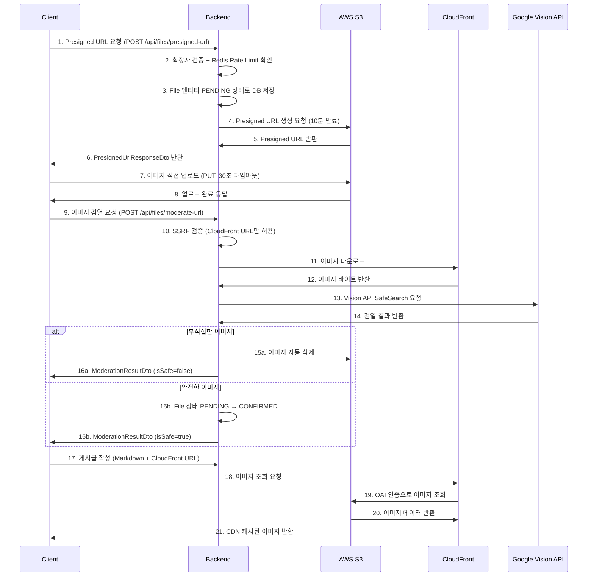

# 14. 이미지 업로드 파이프라인 상세 구현

> S3 Presigned URL + CloudFront + Google Vision API를 활용한 보안 강화된 이미지 업로드 시스템

## 목차
- [전체 파이프라인 플로우](#전체-파이프라인-플로우)
- [보안 검열 시스템](#보안-검열-시스템)
- [성능 최적화](#성능-최적화)
- [기술 구현 세부사항](#기술-구현-세부사항)
- [에러 처리 및 복구](#에러-처리-및-복구)

---

## 전체 파이프라인 플로우

### 이미지 업로드 프로세스



### 단계별 상세 설명

#### 1단계: Presigned URL 생성

`FileController.getPresignedUrl()` - 모든 응답은 타입 안전 DTO 사용.

```java
@PostMapping("/presigned-url")
public ResponseEntity<CommonResponse<PresignedUrlResponseDto>> getPresignedUrl(
        @RequestParam("filename") String filename,
        @RequestParam(value = "contentType", required = false) String contentType,
        HttpServletRequest request) {

    // 파일 확장자 검증
    if (!extension.matches("jpg|jpeg|png|gif|bmp|webp|svg")) {
        return ResponseEntity.badRequest().body(
            CommonResponse.error("지원되지 않는 이미지 형식입니다.")
        );
    }

    // Redis 기반 Rate Limiting (IP당 20회/시간, 100회/일)
    if (!rateLimitService.isPresignedUrlAllowed(clientIp)) {
        return ResponseEntity.status(429).body(
            CommonResponse.error("Presigned URL 생성 한도를 초과했습니다.")
        );
    }

    PresignedUrlResponseDto result = s3Service.generatePresignedUrl(filename, contentType);
    return ResponseEntity.ok(CommonResponse.success(result));
}
```

#### 2단계: S3 직접 업로드
```typescript
// 클라이언트에서 S3에 직접 업로드 (30초 타임아웃)
const controller = new AbortController();
setTimeout(() => controller.abort(), 30000);

const uploadResponse = await fetch(presignedData.uploadUrl, {
    method: 'PUT',
    body: file,
    headers: {
        'Content-Type': file.type
    },
    signal: controller.signal
});
```

#### 3단계: Google Vision API 검열 (동기 처리)
```java
@PostMapping("/moderate-url")
public ResponseEntity<CommonResponse<ModerationResultDto>> moderateUrl(
        @RequestParam("imageUrl") String imageUrl,
        @RequestParam("s3Key") String s3Key,
        HttpServletRequest request) {

    // CloudFront URL만 허용 (SSRF 방지)
    if (!isCloudFrontUrl(imageUrl)) {
        throw new SecurityException("허용되지 않는 URL입니다.");
    }

    byte[] imageBytes = downloadImage(imageUrl);
    boolean isSafe = s3Service.validateUploadedImage(imageBytes);

    if (!isSafe) {
        s3Service.deleteObject(s3Key);
        return ResponseEntity.ok(CommonResponse.success(
            ModerationResultDto.completed(false, "부적절한 이미지가 감지되어 삭제되었습니다.")
        ));
    }

    return ResponseEntity.ok(CommonResponse.success(
        ModerationResultDto.completed(true, "이미지 검증이 완료되었습니다.")
    ));
}
```

---

## 보안 검열 시스템

### 다층 보안 검증

#### 1단계: 클라이언트 사이드 검증
```typescript
// 파일 형식 검사 (MIME 타입)
const validImageTypes = ['image/jpeg', 'image/png', 'image/gif', 'image/webp'];
if (!validImageTypes.includes(file.type)) {
    throw new Error('지원되는 이미지 형식이 아닙니다.');
}

// 파일 크기 체크 (10MB 제한)
if (file.size > 10 * 1024 * 1024) {
    throw new Error('이미지 크기는 10MB를 초과할 수 없습니다.');
}
```

#### 2단계: 서버 사이드 검증 (일반)
```java
// FileController - 파일 확장자 검사
if (!extension.matches("jpg|jpeg|png|gif|bmp|webp|svg")) {
    return ResponseEntity.badRequest().body(
        CommonResponse.error("지원되지 않는 이미지 형식입니다.")
    );
}
```

#### 2단계 (강화): SecureS3Service 추가 검증
```java
// SecureS3Service - 인증된 사용자 전용, 더 엄격한 검증
// 허용 확장자: jpg, jpeg, png, gif, webp, bmp (SVG 제외)
// 파일명 검증: 최대 255자, '..' / '/' / '\' 차단 (경로 순회 방지)
// Content-Type 검증: image/ 로 시작 + 확장자-MIME 매칭 (예: .jpg → image/jpeg)
```

#### 3단계: Google Vision API SafeSearch (REST API 방식)
```java
// GoogleVisionService.isImageSafe()
// REST 호출: POST https://vision.googleapis.com/v1/images:annotate
// 요청: Base64 인코딩된 이미지 + SAFE_SEARCH_DETECTION feature

// 검사 카테고리: adult, violence, racy, spoof, medical
// 차단 기준: LIKELY 또는 VERY_LIKELY → 부적절 판정
// 허용: UNKNOWN, POSSIBLE (우주/과학 이미지 오탐 방지)
// API 실패 시: true 반환 (허용적 폴백)
```

### SSRF 취약점 방지

```java
private boolean isCloudFrontUrl(String imageUrl) {
    if (imageUrl == null) return false;

    try {
        URI uri = new URI(imageUrl);
        String host = uri.getHost().toLowerCase();

        // HTTPS 프로토콜 + CloudFront 도메인만 허용
        return "https".equals(uri.getScheme()) &&
               (host.endsWith(".cloudfront.net") || host.equals(configuredCloudFrontDomain));
    } catch (Exception e) {
        return false;
    }
}
```

### 파일 상태 추적 (Orphan 방지)

```java
// File 엔티티 상태 관리
public enum FileStatus {
    PENDING,    // Presigned URL 발급됨, 확인 대기 중
    CONFIRMED   // 게시글 저장 완료, 파일 확정
}

// Presigned URL 생성 시 → PENDING 상태로 DB 저장
// 검열 통과 시 → CONFIRMED 상태로 변경
// 7일 이상 PENDING 상태 → Orphan으로 판정, 관리자 수동 정리
```

---

## 성능 최적화

### S3 직접 업로드로 서버 부하 감소

```
기존: Client → Server → S3 (서버 메모리/CPU 소모)
개선: Client → S3 직접 (서버는 URL 생성만 담당)
```

### CloudFront CDN 활용

```
- Origin Access Identity (OAI)로 S3 직접 접근 차단
- 전 세계 엣지 로케이션 캐싱
- HTTPS 강제 적용
- Signed URL 발급 (1시간 만료)
```

### Redis 기반 Rate Limiting

```java
@Service
public class FileUploadRateLimitService {

    private final RedisTemplate<String, String> redisTemplate;

    // Presigned URL: IP당 20회/시간, 100회/일
    public boolean isPresignedUrlAllowed(String clientIp) { ... }

    // 파일 업로드: IP당 10회/시간, 50회/일
    public boolean isUploadAllowed(String clientIp, long fileSize) { ... }

    // 동시 업로드: 최대 3개
    public void startUpload(String clientIp) { ... }
    public void finishUpload(String clientIp) { ... }

    // 파일 크기: IP당 50MB/시간
    // 슬라이딩 윈도우 + Redis key 만료
    // 초과 시 :blocked 접미사 키로 차단
    // clearIpLimit()으로 수동 초기화 가능
}
```

---

## 기술 구현 세부사항

### 타입 안전 DTO 체계

모든 파일 관련 엔드포인트는 `Map<String, Object>` 대신 타입 안전 DTO를 사용:

```java
// Presigned URL 응답
public record PresignedUrlResponseDto(
    String uploadUrl,       // S3 Presigned URL (10분 만료)
    String url,             // CloudFront URL
    String s3Key,
    String originalName,
    String contentType
) {}

// 검열 결과 응답
@Getter @Builder
public class ModerationResultDto {
    private String status;      // "completed", "error"
    private boolean isSafe;
    private String message;
}

// CloudFront Signed URL 응답
public record ViewUrlResponseDto(
    String viewUrl,         // Signed CloudFront URL (1시간 만료)
    String s3Key
) {}

// 파일 정보
public record FileDto(
    String originalName,
    String s3Key,
    String url
) {}

// 공통 래퍼
public class CommonResponse<T> {
    private boolean success;
    private String message;
    private T data;
}
```

### 클립보드 이미지 지원

```typescript
const handlePaste = async (event: ClipboardEvent) => {
    const items = event.clipboardData?.items;
    if (!items) return;

    for (let i = 0; i < items.length; i++) {
        if (items[i].type.indexOf('image') !== -1) {
            event.preventDefault();
            const file = items[i].getAsFile();
            if (!file) continue;

            // 모바일 환경 제한 (브라우저 한계)
            if (isMobile()) {
                setValidationAlert({
                    message: '모바일에서는 이미지 붙여넣기가 제한될 수 있습니다.',
                    type: 'warning'
                });
                return;
            }

            const imageData = await uploadClipboardImage(file);
            onImageInsert(imageData, '클립보드 이미지');
            break;
        }
    }
};
```

### 프론트엔드 업로드 유틸리티 (`s3Upload.ts`)

```typescript
export const uploadImage = async (
    file: File,
    needsModeration = true
): Promise<UploadedImageResponse> => {
    // 1. Presigned URL 요청 (15초 타임아웃)
    const presignedData = await axios.post('/api/files/presigned-url', ...);

    // 2. S3 직접 업로드 (30초 타임아웃, AbortController)
    await fetch(presignedData.uploadUrl, { method: 'PUT', body: file });

    // 3. 이미지 검열 (20초 타임아웃)
    if (needsModeration) {
        const result = await axios.post('/api/files/moderate-url', ...);
        // Lombok @Getter: isSafe → JSON "safe" 필드로 직렬화
        if (!result.data.data.safe) {
            throw new Error('부적절한 이미지');
        }
    }

    // 4. 성공 시 반환
    return { url, s3Key, originalName, contentType };
};
```

### 관리자 파일 관리 엔드포인트

```java
// AdminFileController (@PreAuthorize("hasRole('ADMIN')"))

GET  /api/admin/files/orphan-count     → CommonResponse<Integer>
POST /api/admin/files/cleanup-orphans  → CommonResponse<Integer>  // 7일 이상 PENDING 삭제
GET  /api/admin/files/s3-status        → CommonResponse<S3StatusDto>
```

```java
// S3StatusDto - S3 연결 상태 진단
@Getter @Builder
public class S3StatusDto {
    private String bucketName;
    private String configuredRegion;
    private ConnectionStatus connectionStatus;  // SUCCESS, ERROR
    private boolean bucketExists;
    private boolean regionMatch;
    private String actualRegion;
    private String error;
    private String suggestion;
}
```

---

## 에러 처리 및 복구

### 프론트엔드 에러 처리

```typescript
try {
    const response = await axios.post('/files/presigned-url', ...);
} catch (error: any) {
    if (error.code === 'NETWORK_ERROR') {
        throw new Error('네트워크 연결을 확인해주세요.');
    }
    if (error.code === 'ECONNABORTED') {
        throw new Error('서버 응답 시간이 초과되었습니다.');
    }
    if (error.message.includes('CORS')) {
        throw new Error('브라우저 보안 정책으로 인해 업로드가 차단되었습니다.');
    }
}

// 검열 네트워크 실패 시 → S3 업로드 파일 자동 삭제
try {
    await axios.post('/api/files/moderate-url', ...);
} catch (moderationError) {
    await axios.delete('/api/files/delete', { params: { s3Key } });
    throw moderationError;
}
```

### Orphan 이미지 정리 (관리자 수동)

```java
// S3Service.cleanupOrphanImages() - @Transactional
// 관리자가 POST /api/admin/files/cleanup-orphans 호출 시 실행
// 자동 스케줄링은 없음 (수동 트리거 전용)

public int cleanupOrphanImages() {
    // 7일 이상 PENDING 상태인 File 레코드 조회
    List<File> orphans = fileRepository.findByStatusAndCreatedAtBefore(
        FileStatus.PENDING, LocalDateTime.now().minusDays(7));

    for (File orphan : orphans) {
        deleteObject(orphan.getS3Key());  // S3에서 삭제
        fileRepository.delete(orphan);    // DB에서 삭제
    }
    return orphans.size();
}
```

### IP 추출 (프록시/CDN 대응)

```java
// IpUtil - 다중 헤더 기반 IP 추출
// 우선순위: X-Client-IP → X-Forwarded-For → X-Real-IP → Proxy-Client-IP → RemoteAddr
// localhost, 127.0.0.1, IPv6 루프백 필터링
// X-Forwarded-For 다중 IP 시 첫 번째 사용
```

---

## 성능 지표

| 항목 | 기존 | 현재 | 비고 |
|------|------|------|------|
| 서버 부하 | 100% (서버 경유) | 67% | S3 직접 업로드 |
| 이미지 로딩 | S3 직접 | CloudFront CDN | 전 세계 엣지 캐싱 |
| 보안 검열 | - | Google Vision API | SafeSearch 동기 처리 |
| Rate Limit | - | Redis 기반 | 20회/시간, 100회/일, 동시 3개 |
| SSRF 방지 | - | CloudFront URL 화이트리스트 | HTTPS + 도메인 검증 |
| Orphan 정리 | - | 관리자 수동 | 7일 이상 PENDING 대상 |
| 응답 타입 | Map<String, Object> | 타입 안전 DTO | PresignedUrlResponseDto 등 |

---

## 관련 문서

- [아키텍처 가이드](./03_architecture.md)
- [성능 최적화 전략](./05_optimizations.md)
- [기술 스택 상세](./06_TECH-STACK.md)
- [테스트 전략](./07_testing.md)
