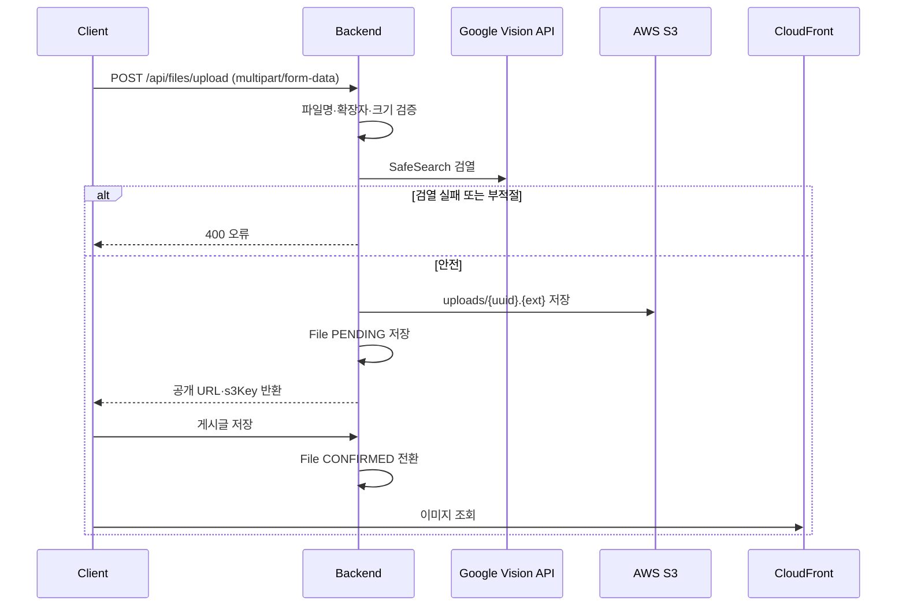

# 11. 이미지 업로드 파이프라인

> 이미지가 검열 전에 CloudFront로 노출되지 않도록 서버 검열 후 공개 저장한다.

## 처리 흐름

```mermaid
sequenceDiagram
    participant C as Client
    participant B as Backend
    participant GV as Google Vision API
    participant S3 as AWS S3
    participant CF as CloudFront

    C->>B: POST /api/files/upload (multipart/form-data)
    B->>B: 파일명·확장자·크기 검증
    B->>GV: SafeSearch 검열
    alt 검열 실패 또는 부적절
        B-->>C: 400 오류
    else 안전
        B->>S3: uploads/{uuid}.{ext} 저장
        B->>B: File PENDING 저장
        B-->>C: 공개 URL·s3Key 반환
        C->>B: 게시글 저장
        B->>B: File CONFIRMED 전환
        C->>CF: 이미지 조회
    end
```

## 보안 불변식

- S3 `PutObject`는 `GoogleVisionService.isImageSafe()`가 `true`를 반환한 뒤에만 실행한다.
- Vision API 오류나 응답 누락은 안전하다고 간주하지 않고 업로드를 거부한다(fail closed).
- 클라이언트가 S3에 직접 업로드할 수 있는 Presigned URL API는 제공하지 않는다.
- SVG는 허용하지 않으며 `jpg`, `jpeg`, `png`, `gif`, `webp`, `bmp`만 허용한다.
- 파일은 최대 10MB이며 Nginx와 multipart 요청 한도는 헤더 여유를 포함해 12MB다.
- Redis 기반 IP별 횟수·용량·동시 업로드 제한을 적용하고 완료 시 동시 실행 슬롯을 해제한다.

## 주요 구현

| 역할 | 파일 |
|---|---|
| 업로드 API | `controller/file/FileController.java` |
| 파일 형식·크기 검증 | `service/file/SecureS3Service.java` |
| Vision 검열 후 S3 저장 | `service/file/S3Service.java` |
| SafeSearch 호출 | `service/file/GoogleVisionService.java` |
| 프론트 업로드 | `byeolnight-frontend/src/lib/s3Upload.ts` |

`FileStatus.PENDING`은 검열 미완료 상태가 아니라 **검열은 통과했지만 게시글에 아직 연결되지 않은 상태**다. 게시글 저장 시 `CONFIRMED`로 전환하며, 7일 이상 남은 PENDING 파일은 고아 파일 정리 대상이다.

## 검증

- `SecureS3ServiceTest`: 허용하지 않는 형식과 확장자·Content-Type 불일치가 S3 서비스 호출 전에 거부되는지 확인한다.
- `S3ServiceTest`: 검열 거부 또는 Vision API 오류 시 S3 클라이언트를 열거나 File 레코드를 저장하지 않는지 확인한다.
- 프론트는 `npm run type-check`, `npm run lint`, `npm run build`로 multipart 업로드 계약을 검증한다.
